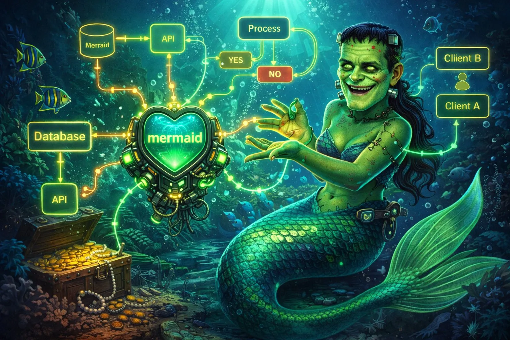

# frankenmermaid

<div align="center">
  
</div>

<div align="center">


</div>

Rust-first Mermaid-compatible diagram engine with smarter parsing, better layouts, and higher-quality output across CLI, SVG, terminal, and web.

<div align="center">
<h3>Quick Install</h3>

```bash
curl -fsSL "https://raw.githubusercontent.com/Dicklesworthstone/frankenmermaid/main/install.sh?$(date +%s)" | bash
```

**Or package managers:**

```bash
# npm (WASM/JS API)
npm install @frankenmermaid/core

# Rust CLI
cargo install frankenmermaid
```

</div>

---

## TL;DR

**The Problem**: Mermaid syntax is great, but large or messy diagrams are fragile in practice. Cycles can layout poorly, malformed input can fail hard, and styling/layout control is often too limited for production docs.

**The Solution**: `frankenmermaid` provides a deterministic Rust pipeline that parses Mermaid-like input with robust recovery, chooses better layout strategies automatically, and renders polished SVG/terminal/web output from a shared IR.

### Why Use frankenmermaid?

| Feature | What It Does |
|---------|--------------|
| **24+ Diagram Types** | Supports mainstream Mermaid families plus DOT bridge and niche chart formats |
| **Intent-Aware Parsing** | Recovers from malformed syntax and infers likely intent instead of failing fast |
| **Cycle-Smart Layout** | Multiple cycle strategies with visible back-edge semantics and layout stats |
| **High-Fidelity SVG** | Responsive, accessible, themeable SVG with polished shapes, labels, and clusters |
| **Web + CLI + Terminal** | One engine across `fm-cli`, `@frankenmermaid/core`, Canvas2D/WebGPU, and terminal output |
| **Deterministic by Design** | Same input/config produces stable layout and render output |

## Quick Example

```bash
# 1) Detect type from raw input
fm-cli detect diagrams/incident-response.mmd

# 2) Validate and show diagnostics (non-fatal warnings included)
fm-cli validate diagrams/incident-response.mmd

# 3) Render responsive SVG
fm-cli render diagrams/incident-response.mmd \
  --format svg \
  --theme blueprint \
  --output out/incident-response.svg

# 4) Render terminal preview
fm-cli render diagrams/incident-response.mmd --format term

# 5) Emit parser IR for tooling and debugging
fm-cli parse diagrams/incident-response.mmd --format json > out/incident-response.ir.json

# 6) Run local playground with live reload
fm-cli serve --open
```

## Design Philosophy

1. **Never Waste User Intent**
Malformed input should degrade gracefully into best-effort IR plus diagnostics, not dead-end errors.

2. **Determinism Is a Feature**
Stable tie-breaking and deterministic layout steps make CI snapshots and documentation diffs trustworthy.

3. **Layout Quality Beats Minimal Correctness**
Cycle handling, crossing minimization, orthogonal routing, and specialized layouts are first-class concerns.

4. **One IR, Many Outputs**
A shared `MermaidDiagramIr` feeds SVG, terminal, Canvas, and WASM APIs so behavior stays consistent.

5. **Polish Is Core Product Surface**
Typography, spacing, theming, accessibility, and responsive behavior are part of correctness.

## How frankenmermaid Compares

| Capability | frankenmermaid | mermaid-js | mermaid-cli (mmdc) |
|------------|----------------|------------|--------------------|
| Parser recovery on malformed input | ✅ Best-effort with diagnostics | ⚠️ Often strict | ⚠️ Depends on upstream parser |
| Cycle-aware layout strategies | ✅ Multiple strategies + metadata | ⚠️ Basic handling | ⚠️ Upstream behavior |
| Specialized layouts (gantt/sankey/kanban/etc.) | ✅ Native specialized pipelines | ⚠️ Mixed quality | ⚠️ Upstream behavior |
| Terminal rendering | ✅ Built-in | ❌ No | ❌ No |
| WASM JS API | ✅ `@frankenmermaid/core` | ✅ Yes | ❌ No |
| Deterministic output focus | ✅ Explicitly enforced | ⚠️ Not primary goal | ⚠️ Not primary goal |
| Implementation language/runtime | ✅ Rust + WASM | JavaScript/TypeScript | Node wrapper |

## Supported Diagram Types

| Category | Types |
|----------|-------|
| Flow & Structure | Flowchart, Sequence, Class, State, ER, C4, Architecture, Block, DOT bridge |
| Planning & Process | Gantt, Timeline, User Journey, Kanban |
| Graph/Network | Git Graph, Sankey, Mindmap |
| Charts | Pie/Donut, Quadrant, Radar, XY, Treemap |
| Specialized | Requirement, Packet |

## Installation

### 1) Quick Install (CLI)

```bash
curl -fsSL "https://raw.githubusercontent.com/Dicklesworthstone/frankenmermaid/main/install.sh" | bash
```

### 2) JavaScript / WASM

```bash
npm install @frankenmermaid/core
```

### 3) Rust (Cargo)

```bash
cargo install frankenmermaid
```

### 4) From Source

```bash
git clone https://github.com/Dicklesworthstone/frankenmermaid.git
cd frankenmermaid
cargo build --release --workspace
```

## Quick Start

1. Create a Mermaid file (for example `demo.mmd`).
2. Run `fm-cli detect demo.mmd` to verify diagram type detection.
3. Render SVG: `fm-cli render demo.mmd --format svg --output demo.svg`.
4. Render terminal preview: `fm-cli render demo.mmd --format term`.
5. If warnings appear, run `fm-cli validate demo.mmd` to inspect diagnostics.
6. For browser apps, use `@frankenmermaid/core` and call `renderSvg()` or `Diagram(...)`.

## Command Reference

Global flags:

```bash
--config <path>        # Config file (TOML/JSON)
--theme <name>         # Theme preset override
--format <fmt>         # Output format
--verbose              # Structured debug logging
--quiet                # Errors only
```

### `fm-cli render`

Render Mermaid input to `svg`, `png`, `term`, or `ascii`.

```bash
fm-cli render input.mmd --format svg --output out.svg
fm-cli render input.mmd --format png --output out.png
fm-cli render input.mmd --format term
```

### `fm-cli parse`

Parse to IR JSON for tooling or debugging.

```bash
fm-cli parse input.mmd --format json
```

### `fm-cli detect`

Detect type + confidence + detection method.

```bash
fm-cli detect input.mmd
```

### `fm-cli validate`

Validate syntax/semantics and print diagnostics with spans and suggestions.

```bash
fm-cli validate input.mmd
```

### `fm-cli watch`

Watch files and re-render on change.

```bash
fm-cli watch diagrams/ --format svg --output out/
```

### `fm-cli serve`

Run local live playground with editor + preview.

```bash
fm-cli serve --host 127.0.0.1 --port 4173 --open
```

## JavaScript / WASM API

```ts
import { init, renderSvg, detectType, parse, Diagram } from '@frankenmermaid/core';

await init({ theme: 'corporate' });

const svg = renderSvg('flowchart LR\nA-->B', { theme: 'neon' });
const type = detectType('sequenceDiagram\nAlice->>Bob: hi');
const ir = parse('classDiagram\nA <|-- B');

const diagram = new Diagram(document.getElementById('canvas-root')!, { renderer: 'canvas2d' });
diagram.render('flowchart TD\nStart-->End');
```

## Configuration

Example `frankenmermaid.toml`:

```toml
# Global behavior
[core]
deterministic = true
max_input_bytes = 5_000_000
fallback_on_error = true

# Parser settings
[parser]
intent_inference = true
fuzzy_keyword_distance = 2
auto_close_delimiters = true
create_placeholder_nodes = true

# Layout defaults
[layout]
algorithm = "auto" # auto | sugiyama | force | tree | radial | timeline | gantt | sankey | grid
cycle_strategy = "cycle-aware" # greedy | dfs-back | mfas | cycle-aware
node_spacing = 48
rank_spacing = 72
edge_routing = "orthogonal" # orthogonal | spline

# Render defaults
[render]
default_format = "svg"
show_back_edges = true
reduced_motion = "auto"

# SVG visual system
[svg]
theme = "corporate"
rounded_corners = 8
shadows = true
gradients = true
accessibility = true

# Terminal renderer
[term]
tier = "rich" # compact | normal | rich
unicode = true
minimap = true
```

Mermaid inline directives are also supported for per-diagram overrides:


## Technical Architecture

### Crate Map

| Crate | Responsibility |
|------|----------------|
| `fm-core` | Shared IR/types/config/errors/diagnostics |
| `fm-parser` | Diagram detection + parsing + error recovery |
| `fm-layout` | Sugiyama/force/tree/specialized layout algorithms |
| `fm-render-svg` | Accessible, themeable SVG generation |
| `fm-render-term` | Terminal renderer + diff/minimap pipeline |
| `fm-render-canvas` | Canvas2D/WebGPU web rendering backend |
| `fm-wasm` | wasm-bindgen API and TypeScript bindings |
| `fm-cli` | End-user CLI (`render`, `parse`, `detect`, etc.) |

### Pipeline

```text
            Mermaid / DOT text
                     |
                     v
        +-------------------------+
        | fm-parser               |
        | - type detection        |
        | - recovery + diagnostics|
        +-------------------------+
                     |
                     v
        +-------------------------+
        | fm-core::MermaidDiagramIr|
        +-------------------------+
                     |
                     v
        +-------------------------+
        | fm-layout               |
        | - auto algorithm select |
        | - cycle strategy        |
        +-------------------------+
                     |
                     v
        +-------------------------+
        | DiagramLayout + stats   |
        +-------------------------+
             |            |             |
             v            v             v
   +---------------+ +-------------+ +---------------+
   | fm-render-svg | | fm-render-  | | fm-render-    |
   |               | | term        | | canvas        |
   +---------------+ +-------------+ +---------------+
             |                          |
             v                          v
      SVG / PNG output          WASM + browser canvas
```

## Quality and Testing

`frankenmermaid` ships with a quality gate focused on correctness and stability:

- Unit tests across parser/core/layout/render crates
- Integration tests for full parse → layout → render pipeline
- Golden SVG snapshots for regression safety
- Property-based tests for parser/layout invariants
- Fuzz targets for malformed input robustness
- E2E corpus across all supported diagram families
- Performance budgets for parser/layout/render and full pipeline latency

## Troubleshooting

### `fm-cli: command not found`

```bash
# Check install path
which fm-cli

# If installed via cargo
export PATH="$HOME/.cargo/bin:$PATH"
```

### WASM package builds but browser demo is blank

```bash
# Rebuild wasm artifacts
./build-wasm.sh

# Ensure you serve over HTTP, not file://
python3 -m http.server 4173
```

### Diagram renders, but labels overlap on dense graphs

Use a layout override and increase spacing:

```bash
fm-cli render dense.mmd --format svg --config frankenmermaid.toml
# set layout.algorithm="force" and increase node_spacing/rank_spacing
```

### Large diagrams feel slow in browser

Use Canvas backend for large graphs and disable visual effects:

```bash
# In config
# render backend: canvas2d or webgpu
# svg.shadows = false
# svg.gradients = false
```

### Output differs from existing Mermaid screenshot

Compare parser diagnostics and explicit config overrides:

```bash
fm-cli validate input.mmd --verbose
fm-cli detect input.mmd
```

## Limitations

- WebGPU backend is optimized for large diagrams but may be unavailable on older browsers or restrictive environments.
- Some niche Mermaid edge syntax may parse with warnings and normalized output rather than pixel-identical upstream rendering.
- Very large diagrams (10k+ nodes) are supported, but SVG may be heavy; Canvas/WebGPU is recommended.
- PNG export rasterizes SVG output; CSS animations are not preserved in static PNGs.

## FAQ

### Is this a Mermaid fork?
No. It is a Rust implementation with its own parser/layout/render pipeline, designed for compatibility and better robustness.

### Can I migrate from `mermaid.initialize(...)` configs?
Yes. `frankenmermaid` accepts common Mermaid-style config objects and maps them to native config keys.

### Does it support malformed diagrams?
Yes. The parser is designed to recover and emit best-effort IR with diagnostics instead of hard failure.

### Which output format should I choose?
Use `svg` for docs/web embedding, `png` for static sharing, `term` for CLI previews, and Canvas/WebGPU for large interactive browser views.

### Is output deterministic for CI snapshots?
Yes. Deterministic tie-breaking and stable pipeline behavior are explicit design goals.

### What is `legacy_mermaid_code/` in this repo?
It is a syntax/reference corpus and compatibility aid. FrankenMermaid is not a direct port of that codebase.

## About Contributions

> *About Contributions:* Please don't take this the wrong way, but I do not accept outside contributions for any of my projects. I simply don't have the mental bandwidth to review anything, and it's my name on the thing, so I'm responsible for any problems it causes; thus, the risk-reward is highly asymmetric from my perspective. I'd also have to worry about other "stakeholders," which seems unwise for tools I mostly make for myself for free. Feel free to submit issues, and even PRs if you want to illustrate a proposed fix, but know I won't merge them directly. Instead, I'll have Claude or Codex review submissions via `gh` and independently decide whether and how to address them. Bug reports in particular are welcome. Sorry if this offends, but I want to avoid wasted time and hurt feelings. I understand this isn't in sync with the prevailing open-source ethos that seeks community contributions, but it's the only way I can move at this velocity and keep my sanity.

## License

MIT License (with OpenAI/Anthropic Rider). See [LICENSE](LICENSE).
