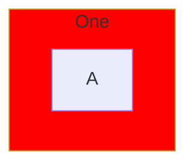

# bd-xfmm — a declared subgraph colour is dropped in the PARSER, and the IR cannot express it

Diagnosis only. Nothing is implemented here: `crates/fm-parser/src/mermaid_parser.rs` was leased by
BeigeHill while this was written, so the work is written up rather than half-landed.

## What a user writes, and what happens

The subgraph renders uncoloured, in **every** renderer, with **no warning**.

## The chain, confirmed at each layer

| layer | site | what it does |
|---|---|---|
| parser | `mermaid_parser.rs:11521` | `style <target>` resolves ONLY via `builder.node_id_by_key(target)`. A subgraph key is not in the node index (`ir_builder.rs:1328` looks up `node_id_index` over `ir.nodes`), so the branch is skipped and the directive is **silently discarded** |
| IR | `fm-core/src/lib.rs:1843` | `IrStyleTarget` is `Class(String) \| Node(IrNodeId) \| Link(usize) \| LinkDefault`. **There is no `Cluster` variant**, so even a parser that wanted to record it has nowhere to put it |
| layout | `fm-layout/src/lib.rs:16484`, `:16848` | `LayoutClusterBox.color` is hardcoded `None` on both flowchart construction paths. Only the group path at `:6249` populates it, from `group.color` |
| renderers | svg `lib.rs:4365`, canvas `renderer.rs` `draw_clusters` | both read `cluster.color`; both correctly fall back to the theme because it is `None` |

## This is NOT the bd-lvj3 shape, and the difference decides the fix

bd-lvj3 was a **renderer** gap: fm-render-svg honoured `style`/`classDef`/`linkStyle` and the canvas
did not, so the same document rendered two ways and one of them was wrong. The fix was to teach the
canvas to read channels that already existed.

Here **both renderers are equally blind**, and correctly so — the colour never reaches either of
them. So this is a **missing channel**, not a regression, and no renderer-side change can fix it.
(That also resolves the item left open on the bead: fm-render-svg does *not* colour a styled subgraph
either. It emits only the generic `fm-cluster` / `fm-cluster-c4` / `fm-cluster-swimlane` classes —
`lib.rs:4400-4415` — with no per-cluster declared paint.)

## Two candidate fixes, smallest first

**1. Make the silence visible (parser only, ~10 lines).** When a `style` target resolves to no node,
emit a warning instead of dropping it. Today a typo and an unsupported subgraph target are both
perfectly silent, which is the worst property this has: the user cannot tell "not supported" from
"you spelled it wrong". Precedent exists in this file — the duplicate-gitgraph-branch warning uses
`builder.add_warning`. This does not colour anything; it stops the failure being invisible.

⚠️ Needs a control that an ordinary valid `style a fill:` emits NO warning, or the whole corpus
starts warning.

**2. Add the channel (cross-crate).** `IrStyleTarget::Cluster(IrClusterId)`, resolved in the parser
against the subgraph key index, carried onto `LayoutClusterBox.color` at the two `None` sites, and
already honoured by both renderers once it arrives. Touches fm-core, fm-parser, fm-layout — three
crates that are frequently leased, so it wants a single agent holding all three.

⚠️ `IrStyleTarget` is `PartialEq`-matched in several places (`fm-render-svg/src/lib.rs:2868`,
`fm-parser/src/dot_parser.rs:2685+`); a new variant must be checked at each, not just added.

## Do not do this

Populating `LayoutClusterBox.color` from something layout can already see. There is nothing to see —
the colour was destroyed two layers earlier, in the parser. Any value invented at the layout layer
would be a guess dressed as the author's intent.
