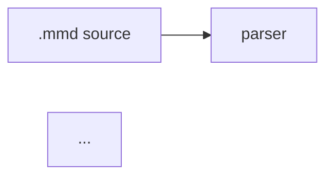

# Graph Deck — Presentation Mode for frankenmermaid

> **Status:** PLANNING (round 3 — steady state reached: two adversarial review rounds
> integrated, third-round consistency pass applied; ready for external review / beadization)
> **Author:** Claude (planning workflow), 2026-08-25
> **Inspiration:** [`yoheinakajima/graphcon-deck`](https://github.com/yoheinakajima/graphcon-deck) — a single-file
> "knowledge-graph presentation engine" shown at GraphCon 2026.
> **Tracking epic (proposed):** `bd-deck` (to be created after plan reaches steady state)

---

## Table of contents

1. [Part I — Vision and motivation](#part-i--vision-and-motivation)
2. [Part II — Design principles and hard constraints](#part-ii--design-principles-and-hard-constraints)
3. [Part III — Architecture overview and key decisions](#part-iii--architecture-overview-and-key-decisions)
4. [Part IV — The deck definition language](#part-iv--the-deck-definition-language)
5. [Part V — IR types (fm-core)](#part-v--ir-types-fm-core)
6. [Part VI — Parser changes (fm-parser)](#part-vi--parser-changes-fm-parser)
7. [Part VII — Scene resolution and manifest building (fm-render-svg)](#part-vii--scene-resolution-and-manifest-building-fm-render-svg)
8. [Part VIII — The DeckManifest schema](#part-viii--the-deckmanifest-schema)
9. [Part IX — WASM surface (fm-wasm)](#part-ix--wasm-surface-fm-wasm)
10. [Part X — CLI surface (fm-cli)](#part-x--cli-surface-fm-cli)
11. [Part XI — The browser deck runtime](#part-xi--the-browser-deck-runtime)
12. [Part XII — Showcase demo section](#part-xii--showcase-demo-section)
13. [Part XIII — Testing strategy](#part-xiii--testing-strategy)
14. [Part XIV — Documentation, claims, changelog](#part-xiv--documentation-claims-changelog)
15. [Part XV — Task breakdown and dependency graph](#part-xv--task-breakdown-and-dependency-graph)
16. [Part XVI — Risks and mitigations](#part-xvi--risks-and-mitigations)
17. [Part XVII — Non-goals and future work](#part-xvii--non-goals-and-future-work)
18. [Appendix A — graphcon-deck schema reference](#appendix-a--graphcon-deck-schema-reference)

---

## Part I — Vision and motivation

### I.1 What graphcon-deck is (self-contained description)

`graphcon-deck` is a ~3,600-line single-file HTML app by Yohei Nakajima. Its core insight:
**a presentation about a graph should itself be one graph, and slides should be camera moves
over it.** Concretely:

- Every node of every "slide" lives at an authored `[x, y]` position on one infinite 2D canvas
  (each slide has an `anchor` offset; node positions are relative to their slide's anchor).
- A slide is: a title + caption + a set of member nodes + optional `include`s of nodes owned by
  other slides + intra-slide edges. A global `connections` list draws cross-slide edges
  (`kind: "cross"` dashed indigo, `kind: "spine"` faint gray).
- On slide change, the camera tweens (lerp, ~0.065/frame) to fit the slide's node bounding box
  with a `fitMargin`, capped at `zoomMax`. Every node **not** in the slide glides out past the
  viewport edge along the ray from the window center ("push-out", eased), so the visible world
  contains only the current scene while the whole graph remains one continuous space.
- Within a slide, nodes carry `step: N`; pressing next reveals step 1, 2, … with a staggered
  connectivity-first animation (a freshly revealed node that connects to something already
  visible appears first). Pressing back un-reveals the last step; only at step 0 does it move
  to the previous slide.
- The final scene is an **overview**: camera zooms out to the entire graph and a border
  rectangle replays every slide's camera window in a loop ("tour"), with the highlight and
  push-out following the moving window.
- Extras: hover tooltips (`node.tip`), click a dimmed node to travel to its owning slide,
  drag-pan/scroll-zoom free camera (slide navigation restores the tour camera), an edit panel
  (drag nodes to reposition, sliders for fitMargin/pushMargin/zoomMax/floatAmp, undo, JSON
  import/export), gentle idle "float" animation on every node, and styling maps
  (`nodeStyles` / `edgeStyles` keyed by space-separated `kind` tokens).

The deck itself is a JSON object (`meta`, `styling`, `assets`, `layoutDefaults`, `slides`,
`connections`) embedded in the file. There is **no layout engine and no diagram language** —
every position is hand-authored, and the node/edge model is bespoke.

### I.2 Why this belongs in frankenmermaid

frankenmermaid's pipeline already produces everything graphcon-deck had to hand-author, plus
everything it lacked:

| graphcon-deck needs | frankenmermaid already has |
|---|---|
| Hand-authored `[x,y]` for every node | Deterministic layout: 15 algorithms, byte-stable output (`fm-layout`) |
| Bespoke JSON node/edge model | `MermaidDiagramIr` from real Mermaid/DOT source, 24 diagram types |
| Manual grouping via slide ownership | Subgraphs/clusters with a reverse index (`IrGraphNode.subgraphs`, `crates/fm-core/src/lib.rs:1715`) and recursive member expansion (`subgraph_members_recursive`, `:1872`) |
| Hand-assigned reveal `step`s | Layout ranks (`LayoutNodeBox.rank`) to derive reveal order automatically |
| Nothing addressable | Stable, deterministic SVG element ids: `fm-node-{sanitized}-{index}`, `fm-edge-{index}`, `fm-cluster-{index}` (`crates/fm-core/src/lib.rs:5992-6057`) plus `data-id` with the author's node id |
| No validation | Parser diagnostics with spans; a typo'd node reference in a slide becomes an actionable warning |
| No CLI / no CI story | Deterministic artifacts → golden-testable manifests; a `deck` subcommand that emits a shareable standalone HTML presentation |

The feature in one sentence: **author a normal Mermaid diagram, add a small `%%{deck: …}%%`
directive naming slides as subsets of the graph, and frankenmermaid computes a deterministic
"deck manifest" (member sets, camera rectangles, reveal steps, element ids) that a ~500-line
dependency-free browser runtime turns into a graphcon-deck-style guided presentation over the
already-rendered SVG.**

This is the "accurate, efficient, cool" split the feature demands:

- **Accurate** — membership, geometry, and reveal order are computed by the engine from the
  real IR and the real layout, in the same invocation that produced the SVG; the manifest and
  the SVG cannot drift because they share one parse + one layout.
- **Efficient** — the browser runtime does zero graph work: no parsing, no layout, no geometry
  math beyond one fit computation per slide. Camera moves are a single composited CSS
  transform. The manifest is precomputed, rounded, and small (a few KB).
- **Cool** — a Mermaid diagram becomes a zoomable, narrated, step-revealed presentation with a
  finale tour, and `frankenmermaid deck talk.mmd -o talk.html` emits a self-contained file you
  can open anywhere, present from, and email to someone.

### I.3 User stories

1. **The conference speaker.** Writes `architecture.mmd` describing their system with
   subgraphs per domain. Adds a deck directive with 8 slides ("the ingest path", "the storage
   tier", "what happens on failure", …). Runs `frankenmermaid deck architecture.mmd -o
   talk.html`. Presents from the HTML file: arrow keys advance reveals and slides, `f` goes
   fullscreen, the final scene zooms out to the whole system and tours every slide's window.
   No PowerPoint, no Figma, and when the architecture changes they re-run one command.
2. **The docs author.** Embeds the same diagram in their docs site twice: once as a static
   SVG, once wrapped in the deck runtime for a "guided tour" toggle. Because output is
   deterministic, the deck manifest is committed and diffed in PRs like any golden artifact —
   a slide that silently loses a node fails CI.
3. **The showcase visitor.** Scrolls to the new "Graph Deck" section on frankenmermaid.com,
   watches the engine's own architecture present itself, drags/zooms freely, clicks a dimmed
   node and gets teleported to its slide, then clicks "Open in the Operating Theater" to edit
   the deck source live.
4. **The tooling integrator.** Calls `renderDeck(source)` from the WASM API and gets
   `{ svg, manifest, warnings }` in one call; builds their own player (VS Code webview, Slack unfurl,
   kiosk display) against the documented manifest schema without touching Rust.

### I.4 Feature parity decision table vs graphcon-deck

| graphcon-deck feature | v1 disposition | Rationale |
|---|---|---|
| Camera fit + tween per slide | ✅ core | The essence of the feature |
| Membership highlight / dim non-members | ✅ core (dim) | See D7: dim instead of push-out |
| Push-out (non-members glide past viewport edge) | ⏭ v2 experiment | Conflicts with `transform` attrs already on SVG node groups; dim achieves the same narrative focus without touching geometry (Part XVII) |
| Reveal steps + staggered entrance | ✅ core | Manifest precomputes per-step element lists; runtime staggers |
| Overview scene + window-replay tour | ✅ core | Signature move; cheap (one animated `<rect>` + the same fit math); tour windows are clickable (table-of-contents finale) |
| Click dimmed node → travel to its slide | ✅ core | Manifest already maps element id → slides containing it |
| Hover tooltips | ✅ core | `IrNode` tooltip metadata (`IrNodeInteraction`, `fm-core/src/lib.rs:1416-1437`) **plus** deck-scoped `tips` (IV.2) so decks can narrate without `click` directives |
| Free camera (drag pan / wheel zoom / pinch) | ✅ core | Same interaction model as the showcase's proven `PanZoomController` |
| Kiosk autoplay | ✅ core (`autoAdvanceMs`) | Specced in XI.2; disabled under reduced motion |
| Cross-slide `include` of other slides' nodes | ✅ trivially subsumed | In frankenmermaid every node belongs to the *diagram*, not to a slide; any slide may reference any node. No special mechanism needed |
| Cross-slide `connections` (spine/cross edges) | ✅ subsumed | All edges belong to the diagram; per-slide edge policy (`induced`/`touching`/`none`) covers it |
| Idle float animation | ❌ cut from v1 | Per-node float needs the same per-element wrappers as push-out (transform conflict, D7); a whole-viewport wobble is a different, worse feature and would keep the rAF loop from parking. Returns with push-out in v2 (Part XVII) |
| Edit mode (drag nodes, write positions back) | ⏭ future | Positions are computed here, not authored; the meaningful edit surface is the *source text*, which the existing lens system (`diagramLens`/`parseLens`) already owns. See Part XVII |
| Slider panel (fitMargin/zoomMax/…) | ✅ options in the directive | Same knobs, but declared in source so they're versioned and deterministic |
| JSON import/export of the deck | ✅ subsumed | The `.mmd` source *is* the deck; the manifest is the export |
| Bespoke `nodeStyles`/`edgeStyles` maps | ❌ not needed | frankenmermaid themes + `classDef` already style nodes/edges |

### I.5 Supported diagram families (v1)

Deck manifests are emitted **only for families whose SVG renderer produces per-node
addressable element ids** (`fm-node-*` groups with `data-id`). Verified against the golden
corpus: the chart-style special render paths (pie, xyChart, gantt axis internals) emit no
per-node groups (`pie_basic.svg` contains zero `fm-node-*` ids; pie/xychart take early-return
paths at `fm-render-svg/src/lib.rs:3981-4001`), so a deck over them would reference elements
that do not exist.

- **Supported (v1):** flowchart, class, state, ER, C4 (all five), architecture-beta,
  requirement, mindmap, sequence, gitGraph, timeline, journey, kanban, block-beta — the exact
  list is finalized in T5b by a unit test that renders one fixture per claimed family and
  asserts per-node ids exist (the test is the contract; the list above is the expectation).
- **Unsupported (v1):** pie, quadrantChart, xyChart, sankey, gantt, packet-beta. A deck
  directive on these parses and validates normally, but manifest building returns `None` with
  a warning diagnostic `deck: diagram family 'pie' has no addressable elements; deck ignored`.

*Why gate rather than partially support:* a manifest whose element ids don't resolve breaks
the runtime's mount contract and the flagship cross-artifact property test (XIII.3). Gating
is honest, cheap, and the unsupported families are charts, not graphs — a "presentation over
a pie chart" has no camera story anyway.

---

## Part II — Design principles and hard constraints

These are non-negotiable, sourced from `AGENTS.md`, the codebase, and the investigation.

**C1 — Determinism is voting.** The manifest must be a pure function of `(source, config)`:
`BTreeMap` only, all lists sorted or in stable insertion order, coordinates rounded (2 decimal
places) before serialization, no clock reads, no `HashMap` iteration, and **no inputs that
vary by build feature** (this is why auto-reveal is centrality-free — see D11). Precedent:
the `gantt_today` injection comment (`fm-render-svg/src/lib.rs:191-202`) and the hidden
`determinism-manifest` subcommand which hard-fails on non-finite values.

**C2 — One parse, one layout.** SVG and manifest must come from the same IR + layout instance.
Never parse or lay out twice to build a deck: that doubles cost and creates a drift surface.

**C3 — Never waste user intent.** Deck errors degrade, not fail: an unknown node selector is a
warning diagnostic with a span and the slide keeps its other members; an empty slide is dropped
with a warning; a deck with zero valid slides means "no manifest" plus diagnostics, never a
parse failure. This mirrors the parser-recovery philosophy in README "Design philosophy" §1.

**C4 — No file proliferation; new files only for genuinely new functionality.** New files
allowed by this plan: `crates/fm-render-svg/src/deck.rs` (new subsystem),
`crates/fm-cli/src/deck_template.html` (asset), `crates/fm-cli/src/deck_runtime.js`
(new browser subsystem — canonical copy lives inside the crate, see D10), and
`scripts/verify_deck_runtime.mjs` (guard). Everything else is edited in place. No `*_v2.rs`,
no shims.

**C5 — Zero unsafe, clippy pedantic+nursery, `-D warnings`, nightly 2024 edition.** All new
code passes `cargo check/clippy/fmt/test --workspace`.

**C6 — WASM-safe by construction.** The deck directive uses the `%%{…}%%` channel (already
JSON5-parsed and wasm-safe), **not** YAML front matter (unavailable on wasm32,
`mermaid_parser.rs:11997-12005`). No `std::time::Instant` in any new path (`web-time` is the
established workaround where a clock is unavoidable — the deck paths need none).

**C7 — The showcase is hand-edited and guarded.** `index.html` and
`frankenmermaid_demo_showcase.html` are byte-identical copies — every edit lands in both.
`DIAGRAM_SAMPLES` (between `// >>> demo-samples:start/end`) is verified by
`scripts/verify_demo_samples.mjs` to contain exactly one sample per family — **the demo deck
source must live outside those markers.** The presenter stub (`#section-presenter`,
`#presenter-step`, `#presenter-summary`, `#presenter-start`, `?tour=` behavior) is asserted by
the test harness and must survive untouched.

**C8 — Deploy via Wrangler only; never GitHub Actions.** New static assets must be added to
the Wrangler recipe in `AGENTS.md` (the `dist/site` assembly block). Do not create, edit, or
rely on workflow files.

**C9 — Layout cache must not see the deck.** Deck metadata lives on `MermaidDiagramIr`
directly, **not** on `MermaidDiagramMeta` (whose `Eq` derive the deck's `f32` options would
break). The actual cache mechanism: the incremental-layout memo compares the **whole IR**
field-by-field via an exhaustive destructure (`memo_ir_equal`, `fm-layout/src/lib.rs:1871+`).
Adding the `deck` field will make that destructure a compile error; the fix is to bind it as
`deck: _` **with a comment citing this constraint** — the deck is consumed strictly
post-layout and must never invalidate the memo. Required T1 test: two parses differing only
in deck payload produce a layout-memo cache hit (assert via the traced-layout
`incremental.cache_hit`). This is both correctness hygiene and a real UX win in watch/
live-edit flows: retitling a slide re-renders without re-laying-out.

**C10 — Security: deck text is untrusted.** Slide titles/captions/tips reach the DOM. The
browser runtime uses `textContent` exclusively (never `innerHTML`) for deck-sourced strings;
the CLI HTML template escapes them (X.2 names the concrete helper). The manifest JSON block
applies the `<\/script` guard. No link/URL fields in v1 (nothing to sanitize).

**C11 — Public API stays narrow.** The wasm-bindgen surface is "intentionally narrow" (README).
One new export (`renderDeck`) rather than three partial ones.

**C12 — Capability claims are executable.** The new surfaces register in
`fm-core::surface_capability_claims()` (`crates/fm-core/src/lib.rs:633`) with evidence refs, so
`fm-cli capabilities` and the README generated block stay truthful.

---

## Part III — Architecture overview and key decisions

### III.1 Dataflow

```
 .mmd source ──► fm-parser ──────────────► MermaidDiagramIr
   (contains        │ multi-line %%{deck}%%    │  .deck: Option<Box<IrDeck>>   (selectors, raw)
    %%{deck:…}%%)   │ scanner + parse          │
                    └─ post-parse semantic     ▼
                       validation of        fm-layout ────► DiagramLayout      (deck-blind; C9)
                       selectors               │               │
                                               ▼               ▼
                                        fm-render-svg ┌──────────────────────────┐
                                               │      │ deck.rs — two phases     │
                                               ▼      │ 1 resolve_scenes(ir,     │
                                          SVG string  │     layout) — renderer-  │
                                       (stable ids)   │     agnostic, layout     │
                                               │      │     space                │
                                               │      │ 2 project_manifest(      │
                                               │      │     scenes, svg_frame)   │
                                               │      │     — viewBox space      │
                                               │      └──────────┬───────────────┘
                                               │                 ▼
                                               │           DeckManifest (serde, fm-core types)
                                               │                 │
              ┌────────────────────────────────┴────────┬────────┴──────────────┐
              ▼                                         ▼                       ▼
        fm-wasm renderDeck()                 fm-cli deck subcommand      fm-cli render
        → { svg, manifest }                  → standalone talk.html      --deck-manifest-out
              │                                (svg + manifest +         → deck.json artifact
              ▼                                 embedded runtime)
        showcase #deck section  ◄──────────────────┐
              │                                    │
              └────────────► crates/fm-cli/src/deck_runtime.js (canonical copy;
                             CLI embeds via include_str!; showcase inlines a
                             marker-fenced copy; deploy ships it to /web/;
                             all copies guarded by verify_deck_runtime.mjs)
```

### III.2 Key decisions (each with rationale)

**D1 — Slides are declared in the Mermaid source via `%%{deck: …}%%` directives, not a
sidecar file.**
*Why:* (a) the directive channel already exists, is JSON5-tolerant, and wasm-safe
(`extract_config_directive_payload`, `mermaid_parser.rs:12213-12225`, currently
`init` | `constraints`); (b) a sidecar file cannot work in the browser WASM path or the
live-editor showcase, where there is exactly one text buffer; (c) co-locating slides with
the diagram keeps them versioned, diffable, and impossible to orphan. The `constraints`
directive is the precedent — including its "parse before body, resolve references later"
contract (`parse_layout_constraint_config` doc comment, `mermaid_parser.rs:12090-12096`).
**Caveat found in review:** the existing scanner is strictly single-line; real decks are
multi-line JSON5 blocks, so this plan budgets a multi-line accumulation extension as its own
task (Part VI item 0, task T2a). A sidecar/JS-object input can be added later for
programmatic decks (Part XVII) without changing the manifest.

**D2 — Deck directives are always parsed (not gated by `enable_init_directives`).**
*Why:* the `enable_init_directives` gate exists because init directives change *rendering
config* (themes, security level) and are therefore a trust decision. Deck definitions are
*structural content* — they name subsets of the graph and add no links, scripts, styles, or
config. Verified: `parse_init_directives` (`mermaid_parser.rs:11957`) is not gated in the
parser; gating applies downstream when init *config* is honored. `constraints` follows this
exact model. C10 covers the only injection surface (text → DOM).

**D3 — Deck metadata hangs off `MermaidDiagramIr` (`deck: Option<Box<IrDeck>>`), not
`MermaidDiagramMeta`.**
*Why:* C9 (Eq on Meta would break under `f32` options; the memo destructure gets an explicit
`deck: _` binding). Follows the boxed/optional per-feature-meta pattern of the IR-level
`sequence_meta`/`pie_meta`/`git_graph_meta` fields (`fm-core/src/lib.rs:5195-5201`). Must be
added to `MermaidDiagramIr::empty()` (`fm-core/src/lib.rs:5164-5205` enumerates every field
explicitly) and gets `#[serde(default, skip_serializing_if = "Option::is_none")]` so existing
IR JSON round-trips byte-identically for deckless diagrams (protects `parse --full` goldens
and the serde round-trip property test).

**D4 — Scene resolution + manifest building live in a new `crates/fm-render-svg/src/deck.rs`
module, structured as two pure phases; manifest *types* live in `fm-core`.**
*Why fm-render-svg:* the manifest must express camera rectangles in **SVG viewBox space**,
and the layout→viewBox offsets are private locals of the SVG renderer
(`offset_x = padding - bounds.x`, `offset_y = padding - bounds.y + title_height`,
`fm-render-svg/src/lib.rs:3977-3978`). Building the manifest next to those constants — after
refactoring them into one shared helper (D5) — makes drift structurally impossible.
*Why two phases:* `resolve_scenes(ir, layout) -> Vec<ResolvedScene>` (membership, edge
policy, steps, layout-space bounds) has zero SVG dependence; `project_manifest(scenes,
frame) -> DeckManifest` owns the viewBox projection. The seam keeps phase 1 mechanically
movable to fm-layout if the future terminal/canvas players (Part XVII) want it, makes the
unit battery reviewable, and keeps the "renderer-agnostic by design" claim true of the
*semantics*, not just the types. *Why types in fm-core:* beside `MermaidSourceMap`
(`fm-core/src/lib.rs:5437-5539`, the existing "serde manifest keyed by element id"
precedent) so `fm-wasm` and `fm-cli` can name them without renderer internals. Nothing in
`fm-layout` is `Serialize` (verified: `DiagramLayout` and friends derive only
`Debug, Clone, PartialEq`), so serde mirror types were required anyway.
*Backend gate:* the frame math D5 extracts belongs to the **legacy layout backend** (the
default; `SvgBackend::LegacyLayout`, `fm-render-svg/src/lib.rs:247,644-668`). With
`backend == Scene`, `deck_manifest`/`render_svg_with_deck` return `None` manifest (+
warning) — pairing a scene-rendered SVG with a legacy-frame manifest would silently violate
this decision's whole point. Unit test required.

**D5 — Refactor the SVG frame math into one shared function.**
Extract `fn svg_frame(ir, layout, config) -> SvgFrame { viewbox_width, viewbox_height,
offset_x, offset_y }` used by both `render_layout_to_svg` (`fm-render-svg/src/lib.rs:3720`)
and `deck.rs`. *Why:* today the viewBox math (padding, title band, C4 legend inset) is
inlined; two consumers computing it independently is exactly the "manifest disagrees with SVG
by one title-height" bug class. One function, two callers, one golden test asserting the SVG
viewBox equals the manifest's `viewBox` field.

**D6 — The browser camera is a CSS transform on a wrapper, not `viewBox` animation.**
*Why:* animating `viewBox` re-lays-out the whole SVG every frame — measurably slow on
1,000+-element diagrams, and this engine's pitch is *large* graphs. The showcase's proven
`PanZoomController` (`index.html:3306-3538`) already implements the exact pattern:
`.pan-zoom-container > .pan-zoom-viewport` with `transform: translate3d(…) scale(…)`,
`transform-origin: 0 0`, rAF-coalesced writes. The deck runtime uses the same DOM contract
(and the same dot-grid stage styling) but owns its own tweening (slide-fit targets with
ease-in-out, graphcon's `easeIO` cubic), because `PanZoomController` has no notion of animated
targets. Free-cam drag/wheel reuses the identical math.
**Coordinate contract (review finding):** the fit math is only valid when 1 SVG user unit ==
1 CSS px at scale 1. The renderer defaults to `responsive: true` which emits
`width="100%" height="100%"` — an unpinned SVG letterboxes itself inside its CSS box, adding
an internal scale the CSS camera can't see. Therefore **at mount the runtime pins the SVG**:
read the viewBox, set `style.width/height = viewBox w/h + "px"`, `display:block`,
`max-width/height:none` — the same normalization `PanZoomController.fitToView` performs
(`index.html:3463-3468`). `verify_deck_runtime.mjs` asserts the pin.

**D7 — v1 focus choreography is dim, not push-out.**
*Why:* graphcon's push-out translates each non-member node; frankenmermaid's SVG node groups
already carry `transform="translate(…)"` attributes, and stacking a second animated transform
per element means either rewriting attributes per frame (layout thrash, runtime cost) or CSS
transform overrides (which *replace* the attribute transform per the SVG2 cascade — breaking
positions). Dimming (`opacity` transition on `.fm-deck-dim`, injected class, default opacity
0.07, configurable) reads nearly identically at presentation distance, costs one class toggle
per element per slide change, and — crucially — never mutates geometry, so hit-testing,
tooltips, and travel-clicks stay correct. Push-out (and per-node float, which needs the same
per-element wrapper machinery) returns as a v2 experiment behind an option (Part XVII) once
measured.

**D8 — One combined WASM export: `renderDeck(input, config) → { svg, manifest, warnings }`.**
*Why:* C2 (one parse, one layout) and C11 (narrow surface). A separate `deckManifest()` would
either re-parse or force a stateful handle API. The export is `cfg_attr`-gated like every
existing export so it is natively testable, and it returns `null` manifest + warnings when
the source has no deck directive — callers can use it as a strict superset of `renderSvg`.
Return-shape precedent: the structured `WasmRenderOutput` export
(`fm-wasm/src/lib.rs:1386-1400`), not the plain-`String` `render_svg_js`. See Part IX for the
config-plumbing extraction this requires.

**D9 — CLI: a new `deck` subcommand whose headline output is a *self-contained presentation
HTML*, plus a `--manifest-out` JSON artifact.**
*Why the HTML:* it is the feature's "demo of the demo" — one command turns a `.mmd` into a
file you can present from, matching the repo's pattern of shipping complete experiences (the
showcase) rather than SDKs. Template embedded via `include_str!` with placeholder replacement
(no templating dependency — C5). *Why also the JSON artifact:* CI/golden flows and
third-party players need the raw manifest; follows the `--source-map-out` pattern exactly
(`fm-cli/src/main.rs:4998-5012`).

**D10 — Single canonical runtime file, `crates/fm-cli/src/deck_runtime.js`, embedded/copied
three ways, all guarded.**
*Why inside the fm-cli crate (review finding):* `include_str!` reaching outside the crate
directory (`../../../web/…`) breaks `cargo package`/publish for `frankenmermaid-cli`, which
is on the crates.io publishing path. So the canonical bytes live in the crate. Consumers:
(1) the CLI template embeds it at compile time via `include_str!` (zero drift);
(2) the showcase carries an **inline copy between `// >>> deck-runtime:start/end` markers**
(the showcase must stay self-contained — its four-candidate `./pkg/` loader fallbacks at
`index.html:3545-3623` show how hostile multi-URL-prefix script loading is);
(3) the Wrangler deploy copies it to `dist/site/web/fm-deck-runtime.js` so external users can
hotlink the runtime matching the deployed WASM. A new `scripts/verify_deck_runtime.mjs`
asserts the showcase fenced block (in **both** HTML files) is byte-identical to the canonical
crate file — the same guard architecture as `verify_demo_samples.mjs`. This is the one
deliberate duplication in the plan, and it is machine-checked.

**D11 — Reveal order can be authored (`reveal: [[…], […]]`) or derived (`reveal: "auto"`) —
and auto is rank-based, never centrality-based.**
*Why auto matters:* it is the moment the layout engine visibly out-does graphcon-deck — the
engine knows ranks (`LayoutNodeBox.rank`), so "build up this subsystem in dependency order"
is free for the author. *Why centrality is excluded (review finding):* centrality tiers are
populated only under the optional `fnx-integration` feature, never on wasm32, and never in
default builds (`compute_layout_centrality_tiers` stub, `fm-layout/src/lib.rs:14968-14987`) —
an ordering input that varies by build feature violates C1 and would make the wasm showcase,
default CLI, and fnx-enabled CLI emit three different manifests for one source. Auto order =
`(rank asc, node_index asc)`, grouped into steps by rank, **with a degenerate-rank fallback**
(VII.3) for layouts that assign every node rank 0 (force-directed does exactly this,
`fm-layout/src/lib.rs:10701` — and force is the layout for ER and architecture families).

**D12 — Edges are never named by authors; they are derived per slide by policy.**
*Why:* IR edges have no author-visible id (only `edge_index`), and graphcon's experience shows
authors think in nodes. Policy `edges: "induced"` (default — both endpoints in the member set),
`"touching"` (≥1 endpoint; the off-slide endpoint stays dimmed), or `"none"`. Covers
graphcon's `connections` use cases without a second edge vocabulary.

---

## Part IV — The deck definition language

### IV.1 Syntax

One or more `%%{deck: { … }}%%` directives anywhere in the source (conventionally at the top,
after the header). Payload is JSON5 (unquoted keys, trailing commas, single quotes OK —
`parse_init_payload_value` already falls back to JSON5, `mermaid_parser.rs:12227`).
**Deck directives may span multiple lines** — the block opens with a line starting `%%{deck`
and closes at the first line ending `}%%` (Part VI item 0 specifies the scanner extension;
`init`/`constraints` stay single-line to avoid regressions).



Multiple deck directives **merge in document order**: `title`/`options`/`overview` use
last-writer-wins per key; `slides` arrays concatenate; `tips` maps merge (later wins per
node). *Why:* lets authors co-locate a slide definition next to the diagram region it
narrates in long files, mirroring how `constraints` directives may appear anywhere.

### IV.2 Grammar (all keys, all defaults)

```
deck        := { title?, options?, tips?, slides, overview? }
title       : string                      — deck title (runtime header, HTML <title>)
options     := {
  fitMargin  : number  (default 150)      — viewBox-space padding around slide bounds
  zoomMax    : number  (default 1.4)      — max CSS px per SVG unit when fitting
  dimOpacity : number  (default 0.07)     — opacity of non-member elements, clamp [0,1]
  autoAdvanceMs : number (default 0)      — kiosk autoplay; 0 disables; clamp [0, 600000]
}
tips        := { node-id : string }       — deck-scoped tooltips; merged over IR tooltip
                                            metadata (deck tip wins). Exists so decks can
                                            narrate hub nodes without `click` directive
                                            syntax (which drags link semantics into the SVG)
slides      := [ slide+ ]                 — 1..=64 slides (cap: see IV.5)
slide       := {
  id        : string   (required)         — unique; used in URLs and diagnostics
  title     : string   (default id)
  caption   : string   (default "")
  nodes     : [ selector+ ] (required)    — member selectors, see IV.3
  reveal    : "auto" | [ [selector+]+ ]  (default: none — all members at step 0)
  edges     : "induced" | "touching" | "none"   (default "induced")
  fitMargin : number   (overrides options.fitMargin)
  zoomMax   : number   (overrides options.zoomMax)
}
overview    := {
  title     : string  (default "Overview")
  caption   : string  (default "")
  tour      : bool    (default true)      — replay slide windows with the border rect
  enabled   : bool    (default true)      — false: no auto-appended overview scene
}
selector    := node-id                    — exact author node id, e.g. "parser"
             | "subgraph:" key            — all member nodes of subgraph `key`,
                                            including nested descendants
             | "*"                        — every node in the diagram
```

(`floatAmp` is deliberately absent — see I.4 for why per-node float is deferred to v2.)

### IV.3 Selector semantics

- **Node id** — matched against `IrNode.id` exactly (case-sensitive, like the rest of the
  language). Implicit (auto-created placeholder) nodes are selectable like any other.
- **`subgraph:KEY`** — resolves via `MermaidGraphIr::subgraphs_by_key` then
  `subgraph_members_recursive` (`fm-core/src/lib.rs:1771`, `:1872` — the latter already
  implements members-including-descendants). *Why descendants:* an author pointing at a
  container means "this whole region"; excluding nested children would make every
  C4/architecture deck tediously explicit.
- **`*`** — all nodes. Exists so an author can write a custom overview-style slide mid-deck
  ("here's everything again, but now look at this corner" via a follow-up slide).
- Duplicate resolution is a set union; order of `nodes` does not affect membership (but does
  affect nothing else either — determinism comes from sorted node indexes, Part VII).

### IV.4 Validation diagnostics (all Warning severity, category `Semantic`, with the
directive block's span)

| Condition | Behavior |
|---|---|
| Unknown node id / subgraph key in `nodes`, `reveal`, or `tips` | Warn `deck: slide 'X': unknown selector 'Y'` + suggestion via existing Levenshtein helper if an id within distance ≤2 exists; selector ignored |
| Slide resolves to zero members | Warn; slide dropped from manifest |
| Duplicate slide id | Warn; second occurrence gets `-2` suffix (never dropped — C3) |
| `reveal` selector not in the slide's member set | Warn; selector ignored in steps (still a member if listed in `nodes`) |
| Member matched by more than one reveal group | First (lowest) group wins; warn `deck: slide 'X': 'Y' already revealed at step N` |
| Member in `nodes` but never in any `reveal` group (when reveal is authored) | Silently step 0 (visible from slide entry) — the intended way to have an "always there" anchor node |
| `tips` id valid but not a member of any slide | Warn `deck: tip for 'Y' is unreachable (node is in no slide)` — tooltips only surface through slide membership |
| Deck present but `slides` empty/absent | Warn `deck: no slides defined`; no manifest emitted |
| Deck on an unsupported diagram family (I.5) | Warn; no manifest emitted |
| Payload not an object / `slides` not an array / wrong types | Init-error diagnostic (existing `add_init_error` path); directive ignored |
| Numeric options out of range (negative margins, dimOpacity ∉ [0,1], autoAdvanceMs ∉ [0, 600000], >64 slides) | Warn; clamped (margins to ≥0, opacity into [0,1], autoAdvanceMs into range, slides truncated to 64) |
| Unterminated multi-line deck block (no `}%%` within cap) | Init-error diagnostic; block abandoned, lines re-fed to normal parsing |

*Why warnings and not errors:* C3. The diagram must still render as a plain SVG even when the
deck block is broken; `fm-cli validate --fail-on warning` remains the CI escalation path.

### IV.5 Limits

`MAX_DECK_SLIDES = 64`, `MAX_SELECTORS_PER_SLIDE = 512`, `MAX_DECK_BLOCK_LINES = 400` /
32 KB per directive block, title/caption/tip truncated at 512 chars. *Why:* directives are
attacker-reachable input (pasted diagrams); resolution is O(slides × selectors × log n) and
these caps keep the worst case trivial while being far above any real presentation.

---

## Part V — IR types (fm-core)

New types in `crates/fm-core/src/lib.rs` (placed beside `MermaidSourceMap`):

```rust
/// Raw deck definition as parsed from `%%{deck: …}%%` directives.
/// Selectors are stored unresolved (strings) because directives parse before the
/// diagram body — same contract as layout constraints. Resolution happens post-parse
/// (validation) and at manifest-build time (fm-render-svg::deck).
#[derive(Debug, Clone, PartialEq, Serialize, Deserialize)]
pub struct IrDeck {
    pub title: Option<String>,
    pub options: IrDeckOptions,
    /// Deck-scoped tooltips: author node id → tip text (BTreeMap: determinism, C1).
    pub tips: BTreeMap<String, String>,
    pub slides: Vec<IrDeckSlide>,
    pub overview: IrDeckOverview,
    /// Span of the first deck directive block — anchor for deck-level diagnostics.
    pub span: Span,
}

#[derive(Debug, Clone, PartialEq, Serialize, Deserialize)]
pub struct IrDeckOptions {
    pub fit_margin: f32,      // default 150.0
    pub zoom_max: f32,        // default 1.4
    pub dim_opacity: f32,     // default 0.07
    pub auto_advance_ms: u32, // default 0
}

#[derive(Debug, Clone, PartialEq, Serialize, Deserialize)]
pub struct IrDeckSlide {
    pub id: String,
    pub title: String,
    pub caption: String,
    pub nodes: Vec<String>,               // raw selectors
    pub reveal: IrDeckReveal,
    pub edges: IrDeckEdgePolicy,
    pub fit_margin: Option<f32>,
    pub zoom_max: Option<f32>,
    pub span: Span,                       // span of the declaring directive block
}

#[derive(Debug, Clone, PartialEq, Serialize, Deserialize)]
pub enum IrDeckReveal { None, Auto, Groups(Vec<Vec<String>>) }

#[derive(Debug, Clone, Copy, PartialEq, Eq, Serialize, Deserialize)]
#[serde(rename_all = "lowercase")]
pub enum IrDeckEdgePolicy { Induced, Touching, None }

#[derive(Debug, Clone, PartialEq, Serialize, Deserialize)]
pub struct IrDeckOverview {
    pub enabled: bool,        // default true
    pub title: String,        // default "Overview"
    pub caption: String,
    pub tour: bool,           // default true
}
```

`MermaidDiagramIr` gains:

```rust
#[serde(default, skip_serializing_if = "Option::is_none")]
pub deck: Option<Box<IrDeck>>,
```

with `deck: None` added to `MermaidDiagramIr::empty()`, and `deck: _` bound (with the C9
comment) in `memo_ir_equal`'s destructure in fm-layout. `Box` keeps the always-present IR
small for the 99% of diagrams with no deck (same reasoning as `IrNodeInteraction` boxing on
`IrNode`).

The **manifest** types (`DeckManifest`, …) also live in fm-core — full schema in Part VIII.

---

## Part VI — Parser changes (fm-parser)

All in `crates/fm-parser/src/mermaid_parser.rs` + `ir_builder.rs`, following the
`constraints` template.

0. **Multi-line directive extraction (new capability — task T2a).** The current scanner is
   strictly line-based: `parse_init_directives` iterates `byte_lines`
   (`mermaid_parser.rs:11964-11967`) and `extract_config_directive_payload` requires one
   trimmed line matching `%%{…}%%` (`:12214-12218`). Extension: a line whose trimmed form
   starts with `%%{deck` (case-insensitive on the directive name) but does **not** contain
   `}%%` opens an accumulation window; subsequent raw lines are appended until the first line
   whose trimmed form **ends with** `}%%` — trailing content after `}%%` on the closing line
   is not recognized as a terminator (cap per IV.5; on cap overrun emit an init-error and
   re-feed the buffered lines to normal parsing). Known limitation, documented: a JSON5
   string value containing the literal `}%%` terminates the block early; the resulting
   payload fails JSON5 parsing and surfaces as the existing init-error — acceptable, since
   deck text has no reason to contain that sequence. The captured block gets a **multi-line
   `Span`** covering first through last line. Only `deck` gets this treatment — `init` and
   `constraints` remain single-line so their behavior cannot regress. The same accumulation
   must be mirrored in `capture_format_complement` (`lib.rs:2126`, classifier at
   `:2190-2194`) so the whole block classifies as **one** directive region and lens
   round-trips preserve it verbatim — with a dedicated multi-line lens round-trip test.
   Body parsers must also skip the block's interior lines (the accumulation happens in the
   directive pre-pass, which runs before the body — the pre-pass records the consumed line
   range and the body loop skips it; single-line `%%` comment skipping is untouched).
1. **Whitelist** — `extract_config_directive_payload` (`:12220`): add
   `|| directive.eq_ignore_ascii_case("deck")` (single-line decks — e.g. a one-slide deck —
   still work through the existing path).
2. **Routing** — in `parse_init_directives`: when the directive is `deck`, call a new
   `parse_deck_config(&parsed_value, context, span, builder)` instead of wrapping into
   `apply_mermaid_config_value`.
3. **`parse_deck_config`** — modeled on `parse_layout_constraint_config`
   (`:12096`): validates shape, warns on unknown keys (`builder.add_warning`), clamps numeric
   ranges (IV.4), constructs/merges `IrDeck` into a new `IrBuilder` field
   (`deck: Option<IrDeck>`), which the builder's finish step moves onto the IR. Merging rule
   per IV.1. Type errors route through `add_init_error`.
   **Builder-reuse lifecycle (review finding):** the builder participates in incremental
   reuse (`finish_reusable` / `reusable_prefix_unchanged`, `ir_builder.rs:1455-1485`, which
   compare meta and node/edge prefixes — all deck-blind). The `deck` accumulator must be
   **reset at the start of every parse** in the reusable path, and a required test re-parses
   with only the deck payload changed and asserts (a) the new deck lands on the IR and
   (b) the layout memo still hits (C9 test pairing).
4. **Post-parse semantic validation** — after the diagram body has been parsed (node ids now
   known), alongside `apply_semantic_recovery()`: resolve every selector purely for
   *diagnostic* purposes (IV.4 table) using the built node-id set and subgraph keys. Fuzzy
   suggestion reuses the existing `levenshtein_distance` helper. The resolved sets are
   **not** stored — resolution happens again (cheaply, against the same IR) at manifest time.
   *Why not store them:* storing `Vec<IrNodeId>` on the IR would duplicate truth (raw +
   resolved) and go stale under lens edits; resolution is O(selectors·log n) and free at
   manifest scale.

Not touched: detection, body parsers (beyond the skip-range in item 0), DOT bridge. A DOT
input takes the `parse_dot` branch which never scans Mermaid directives — DOT decks are a
documented v1 limitation (Part XVII).

---

## Part VII — Scene resolution and manifest building (fm-render-svg)

New module `crates/fm-render-svg/src/deck.rs`, two pure phases (D4):

```rust
/// Phase 1 — renderer-agnostic, layout-space. Pure; deterministic.
pub(crate) fn resolve_scenes(ir: &MermaidDiagramIr, layout: &DiagramLayout)
    -> Option<Vec<ResolvedScene>>;   // None: no deck / unsupported family / zero valid slides

/// Phase 2 — viewBox projection using the shared frame (D5).
pub(crate) fn project_manifest(ir: &MermaidDiagramIr, scenes: Vec<ResolvedScene>,
    frame: &SvgFrame) -> DeckManifest;

/// Public entry points.
pub fn deck_manifest(ir: &MermaidDiagramIr, layout: &DiagramLayout,
    config: &SvgRenderConfig) -> Option<DeckManifest>;
pub fn render_svg_with_deck(ir: &MermaidDiagramIr, layout: &DiagramLayout,
    config: &SvgRenderConfig) -> (String, Option<DeckManifest>);
```

`render_svg_with_deck` with `config.backend == SvgBackend::Scene` returns `(svg, None)` plus
a warning (D4 backend gate). Unsupported families (I.5) return `None` with the I.5 warning.

### VII.1 Frame refactor (D5)

Extract from `render_layout_to_svg` (`lib.rs:3720`) into:

```rust
pub(crate) struct SvgFrame {
    pub viewbox_width: f32,
    pub viewbox_height: f32,
    pub offset_x: f32,     // svg_x = layout_x + offset_x
    pub offset_y: f32,     // svg_y = layout_y + offset_y
}
pub(crate) fn svg_frame(ir: &MermaidDiagramIr, layout: &DiagramLayout,
                        config: &SvgRenderConfig) -> SvgFrame;
```

`render_layout_to_svg` must produce **byte-identical output** after this refactor — the ~45
SVG goldens are the proof, and this refactor lands as its own commit *before* any deck logic
so a golden diff bisects cleanly. Unit cases pin `svg_frame` against the legacy inline math
for: plain, titled, and C4-legend diagrams (the legend inset and title band are exactly the
constants a naive reimplementation would miss).

### VII.2 Membership resolution

For each slide, in declaration order:

1. Resolve selectors → `BTreeSet<usize>` of node indexes (node id map built once per
   manifest: `BTreeMap<&str, usize>` over `ir.nodes`; subgraph selectors via
   `subgraphs_by_key` + `subgraph_members_recursive`; `*` → all). Unknown selectors were
   already warned at parse time; here they are silently skipped (never warn twice).
2. Drop the slide if empty (parse-time warning already emitted).
3. **Edges** per policy (D12): iterate `layout.edges` (which carry `edge_index`); resolve
   each edge's endpoints via `ir.edges[edge_index]` endpoints → node indexes
   (`resolve_endpoint_node`); include per policy. Port-rooted edges (ER/class) resolve to
   their parent node — an entity's membership implies its attribute edges. Self-loops are
   induced iff their single endpoint is a member.
4. **Clusters** (display): include `layout.clusters[i]` when ≥1 member node of the underlying
   cluster is in the slide set — the cluster chrome anchors a partially-shown region.
   Clusters record whether they are **fully contained** (every cluster member in the slide
   set); only fully-contained clusters influence the camera (VII.4).

### VII.3 Step assignment

- `IrDeckReveal::None` → every member at step 0; `max_step = 0`.
- `Groups(g)` → group k (1-based) assigns step k to each resolved member of that group's
  selectors ∩ slide members; a member matched by multiple groups keeps the **lowest** step
  (warning per IV.4); unlisted members are step 0.
- `Auto` (D11) → members sorted by `(rank, node_index)` using `LayoutNodeBox.rank`; distinct
  ranks among members become steps in ascending order, first rank = step 0.
  **Degenerate-rank fallback (review finding):** several layouts assign every node the same
  rank (force-directed hardcodes 0 for all nodes, `fm-layout/src/lib.rs:10701`; pie/quadrant
  similar) — rank grouping would then yield a single step-0 wave, i.e. no reveals at all.
  Rule: when the members span **fewer than 2 distinct ranks**, chunk the
  `(rank, node_index)`-sorted members into waves of **5** (last wave may be smaller); wave 1
  is step 0, wave k is step k−1. The constant 5 is a named `const AUTO_WAVE_SIZE: usize`
  (one keypress ≈ one thought-group; tunable later without schema change).
- **Edge steps** are derived, not authored: an edge's step = max(step of its endpoints)
  (touching edges use the on-slide endpoint's step). **Cluster steps** (review finding):
  cluster step = min(step of its in-slide members) — a cluster box appears with its first
  member, never as an empty box at step 0. Clusters join `steps[].elementIds` like nodes and
  edges.
- **Intra-step ordering** (the stagger order the runtime replays verbatim): within each
  `steps[].elementIds` list — nodes first, sorted by `(rank, node_index)`, then edges sorted
  by `edge_index`, then clusters sorted by `cluster_index`. This is the one place emitted
  order is not plain index order; VII.5's sorting rule defers to it for `steps[]`.
- The manifest precomputes per-step reveal lists so the runtime never re-derives any of this.

### VII.4 Camera bounds

Per slide, camera bounds = union of:

- member node `bounds`;
- `bounds` of **fully-contained** clusters only (a slide selecting one node inside a 30-node
  subgraph must frame the node, not the whole subgraph box — partially-contained clusters
  render at half-dim, XI.2, but never steer the camera);
- points of **induced** edges only (a `touching` edge's polyline runs to its off-slide
  endpoint, possibly across the whole diagram; letting it into the union would zoom the
  camera out to near-overview and defeat the policy's purpose — touching edges render at
  half-dim but never steer the camera).

This is deliberately a *restriction* of the union set used by the diagram-level
`compute_bounds` (`fm-layout/src/lib.rs:17561`); the diagram frame wants everything, a slide
frame wants the slide. Then convert to viewBox space via `SvgFrame` offsets and round to 2
decimals. The manifest stores the **tight** rect; `fitMargin`/`zoomMax` ship as numbers for
the runtime to apply (fit depends on the viewer's pixel viewport, which the engine cannot
know). Required golden cases: a single-node slide inside a large subgraph, and a
touching-edge slide whose far endpoint is diagram-distant — both assert tight bounds.

Overview scene camera = full viewBox rect. Tour windows = each slide's tight rect (runtime
applies margins the same way, so the tour rect matches what the visitor saw on that slide).

### VII.5 Determinism rules (C1)

- All sets are `BTreeSet<usize>`; all emitted lists sorted by index — except
  `steps[].elementIds`, which use the VII.3 intra-step ordering; steps ascending;
  `tips` and `nodeSlideIndex` are `BTreeMap`s.
- Coordinates rounded to 2 dp via `(x * 100.0).round() / 100.0` before serialization
  (mirrors the 6-dp canonicalization of layout checksums, but 2 dp because these are
  presentation rects, and shorter JSON matters for the embedded showcase/CLI payloads).
- No build-feature-dependent inputs (D11: no centrality).
- Two consecutive `deck_manifest` calls on the same inputs must produce byte-identical
  `serde_json::to_string` output — a required unit test.

---

## Part VIII — The DeckManifest schema

Serde types in fm-core; `#[serde(rename_all = "camelCase")]` (matching `WasmRenderOutput` /
`SourceSpanRecord` precedent). `schemaVersion` uses semver-as-string so external players can
gate; within 1.x all changes are additive.

```jsonc
{
  "schemaVersion": "1.0.0",
  "generator": "frankenmermaid",
  "diagramType": "flowchart",
  "title": "How frankenmermaid works",        // deck title or null
  "viewBox": { "x": 0, "y": 0, "width": 1892.4, "height": 1104.0 },
  "options": { "fitMargin": 140, "zoomMax": 1.4, "dimOpacity": 0.07, "autoAdvanceMs": 0 },
  "slides": [
    {
      "id": "intro",
      "title": "One shared IR",
      "caption": "every parser writes it, every renderer reads it",
      "bounds": { "x": 40.0, "y": 262.5, "width": 612.2, "height": 341.0 },
      "fitMargin": 140,                        // resolved (slide override or deck default)
      "zoomMax": 1.4,
      "nodes": [                               // sorted by index
        { "index": 0, "sourceId": "src",    "elementId": "fm-node-src-0",    "step": 0,
          "tooltip": null },
        { "index": 3, "sourceId": "parser", "elementId": "fm-node-parser-3", "step": 1,
          "tooltip": "Detection, fuzzy matching, recovery — never panics." },
        { "index": 5, "sourceId": "ir",     "elementId": "fm-node-ir-5",     "step": 2,
          "tooltip": null }
      ],
      "edges":    [ { "index": 2, "elementId": "fm-edge-2", "step": 1, "touching": false },
                    { "index": 4, "elementId": "fm-edge-4", "step": 2, "touching": false } ],
      "clusters": [ { "index": 0, "elementId": "fm-cluster-0", "step": 0,
                      "cameraContained": true } ],
      "maxStep": 2,
      "steps": [                               // precomputed reveal lists, step 1..=maxStep
        { "step": 1, "elementIds": ["fm-node-parser-3", "fm-edge-2"] },
        { "step": 2, "elementIds": ["fm-node-ir-5", "fm-edge-4"] }
      ]
    }
  ],
  "overview": { "enabled": true, "title": "One graph", "caption": "…", "tour": true },
  "nodeSlideIndex": {                          // elementId → slide ids containing it
    "fm-node-parser-3": ["intro", "layout"]    // powers click-to-travel in O(1)
  }
}
```

Notes:

- `elementId` strings are emitted via the *same* fm-core id functions the renderer uses
  (`mermaid_node_element_id` etc.) — the join key contract. A property test asserts every
  manifest `elementId` occurs verbatim in the SVG string (Part XIII).
- `tooltip` is the merge of deck `tips` (wins) over `IrNode` interaction tooltip metadata;
  `null` when absent. The IR read is ungated (tooltip metadata exists on the IR regardless of
  link rendering config).
- `nodes[].step` and `steps[].elementIds` are two views of one fact, both consumed by third
  parties; a XIII.3 property pins their mutual consistency (every element with step k>0
  appears in exactly `steps[k]`, and nowhere else).
- `touching: true` marks edges whose far endpoint is off-slide (runtime renders them at
  half-dim, echoing graphcon's `half` edge state; they never steer the camera — VII.4).
- `clusters[].cameraContained` records the fully-contained flag (VII.4): the runtime renders
  `cameraContained: false` clusters at half-dim (XI.2), and only `true` ones steer the camera.
- `nodeSlideIndex` is a `BTreeMap` — sorted, deterministic.

---

## Part IX — WASM surface (fm-wasm)

One new export in `crates/fm-wasm/src/lib.rs`:

```rust
#[derive(Serialize)]
#[serde(rename_all = "camelCase")]
struct WasmDeckOutput {
    svg: String,
    manifest: Option<fm_core::DeckManifest>,
    /// Serialized diagnostics in the same structured shape the `parse` export emits
    /// (severity/category/message/span) — NOT bare strings, so the showcase can render
    /// a bad selector like any other diagnostic.
    warnings: Vec<WasmDiagnostic>,
}

#[cfg_attr(target_arch = "wasm32", wasm_bindgen(js_name = renderDeck))]
pub fn render_deck_js(input: &str, config: Option<JsValue>) -> Result<JsValue, JsValue> { … }
```

Implementation notes (review findings):

- `render_svg_js` (`:1444-1502`) inlines its config merge, pressure-tier branching, budget
  broker, and degradation logic; there is no shared helper. **T6's scope includes extracting
  that block into a crate-private helper used by both `render_svg_js` and `render_deck_js`**
  — a refactor of a shipping export, gated by the existing wasm tests plus a new parity test:
  same input + same config → `render_deck_js().svg == render_svg_js()` **at nominal pressure
  tier** (the pressure path can legitimately alter guardrails/config, so parity is only
  contractual at nominal tier; the verify script pins it).
- Return-shape precedent is the structured `WasmRenderOutput` export (`:1386-1400`), not the
  plain-string one.
- Native-callable (cfg_attr) → unit-testable without a browser. `manifest: None` + a warning
  when no deck directive exists (D8).
- **TypeScript:** emit the `DeckManifest`/`WasmDeckOutput` types via
  `#[wasm_bindgen(typescript_custom_section)]` so the generated `.d.ts` is the typed API of
  record (a hand-written README interface would drift). Note `pkg/` currently ships both
  `frankenmermaid.d.ts` and a legacy `fm_wasm.d.ts` name — the custom section lands in
  whatever `build-wasm.sh` produces today; no extra work.
- **Size:** `build-wasm.sh` enforces a **540 KB** gzip ceiling (raised 2026-07-24,
  `build-wasm.sh:17-20`); current pkg sits ≈506 KB, so ≈34 KB headroom. deck.rs is set
  arithmetic + serde and should cost single-digit KB; T6 acceptance records the measured
  before/after gzip sizes.

---

## Part X — CLI surface (fm-cli)

### X.1 `fm-cli deck`

New `Command::Deck` variant (after `Validate`, `main.rs:~493`), options struct
`DeckCommandOptions<'a>` beside `ValidateCommandOptions` (`:2912`), handler `cmd_deck`.
The handler reuses the existing render building blocks (`build_base_svg_render_config`
`:3929`, `build_svg_render_config` `:7679`, global `--config` plumbing `:128`) — there is no
single callable parse→layout→render pipeline function today, and `cmd_deck` does **not**
create one speculatively; it composes the same helpers `cmd_render` does.

```
fm-cli deck input.mmd -o talk.html          # standalone presentation HTML (default format)
fm-cli deck input.mmd --manifest-out d.json # additionally write the manifest artifact
fm-cli deck input.mmd --format json         # manifest (not HTML) to stdout / -o
fm-cli deck - < input.mmd                   # stdin, like every other subcommand
```

- `--format {html|json}` is a **new dedicated enum** (`DeckOutputFormat`), not an extension
  of the render `OutputFormat` — deck's formats share nothing with svg/png/term and
  cross-contaminating the enums would put `html` on `render`'s surface.
- `-o/--output` behaves like every subcommand (file or stdout). `--manifest-out` is allowed
  alongside `--format html` (both artifacts in one invocation) and is redundant-but-legal
  with `--format json`.
- Flags shared with render and honored (they change layout/render, hence the manifest):
  `--theme`, `--parse-mode`, `--layout-algorithm`, `--config`, `--font-size`, `--pretty`
  (JSON only). `-W/--width`/`-H/--height` are **rejected** for `deck` (exit 2, clap
  conflict): the presentation HTML is inherently full-viewport and the runtime pins the SVG
  to viewBox pixels (D6) — accepting explicit pixel dimensions would imply a contract the
  runtime deliberately overrides.
- Diagnostics print to stderr through the same path `cmd_validate` uses for text output
  (severity-sorted, span-annotated); exit 0 when a usable manifest exists.
- No deck directive → exit 1 with an actionable error:
  `input has no %%{deck: …}%% directive; see 'Graph decks' in the README`. *Why hard error
  when the library degrades:* the user explicitly asked for a deck; silently emitting a
  slideless page violates least surprise. (`render` never errors on deckless input —
  asymmetry is intentional and documented.)
- Deck present but all slides invalid / unsupported family → exit 1, printing the deck
  diagnostics.

### X.2 The standalone HTML template

`crates/fm-cli/src/deck_template.html`, embedded via `include_str!`, placeholders
`{{TITLE}} {{SVG}} {{MANIFEST_JSON}} {{RUNTIME_JS}} {{BG}} {{FG}}` filled by plain
`str::replace`.

- **DOM contract with the runtime** (must match XI.1's `ui:` option names): the template
  provides `#deck-stage` (mount target, `tabindex="0"`), `#deck-card` with `#deck-num` /
  `#deck-title` / `#deck-caption`, `#deck-dots`, `#deck-prev`, `#deck-next`,
  `#deck-overview-btn`, and a keyboard-hint footer. Wireframe: full-viewport stage; card
  bottom-left; controls bottom-right; hints top-right; `<title>` = `{{TITLE}}`.
- Visual: minimal neutral-dark chrome (system-ui fonts, near-black bg, subtle borders) — not
  the showcase's monster theme; this file represents the *user's* talk. `{{BG}}`/`{{FG}}`
  come from the selected engine theme's `--fm-bg` / `--fm-text-color` values (the theme
  palette is already programmatically accessible in fm-render-svg's theme system —
  `ThemePreset`→`ThemeColors`), so a `--theme dark` deck gets a dark page without a second
  theming system.
- `{{MANIFEST_JSON}}` is embedded inside `<script type="application/json"
  id="deck-manifest">` and read via `textContent` + `JSON.parse`; the writer applies the
  `<\/script` guard.
- **Escaping (review finding):** there is no XML-escape helper visible to fm-cli today
  (`escape_xml_text` in fm-render-svg is `#[cfg(test)]`-private, `attributes.rs:571-578`).
  T7 includes promoting a `pub fn escape_xml_text(&str) -> Cow<str>` in fm-render-svg (docs +
  unit tests) and using it for `{{TITLE}}` and every deck string the template interpolates.
- **Key ownership:** the runtime's stage-scoped handler owns all presentation keys (`f`
  fullscreen, `Escape`, arrows, `o`, Home/End — XI.2); the template implements none of them.
  The template's own wiring is limited to: hash deep links (`location.hash = slide.id` via
  `onSlideChange`, restored on load with `go()`) and focusing the stage on load so keys work
  immediately.

### X.3 `fm-cli render --deck-manifest-out <path>`

Optional flag on the existing render command following `--source-map-out` verbatim
(`:4998-5012` write pattern; guard: SVG format only; `--json` render payload gains
`deck_manifest_slide_count` + `deck_manifest_out` fields). **Deckless input with this flag is
exit 1** with the same actionable error as `deck` — the flag expresses deck intent, and a
silent skip would leave stale files in batch pipelines (review finding). *Why both surfaces:*
`deck` is the product feature; `render --deck-manifest-out` composes with existing render
pipelines without a second invocation, and their byte-equality is the C2 proof at the CLI
layer (XIII.2).

---

## Part XI — The browser deck runtime

`crates/fm-cli/src/deck_runtime.js` (canonical; D10) — ES module *and* classic-script safe
(assigns `window.FmDeckRuntime`; no imports), zero dependencies, ~450-550 lines. Budget:
≤ 20 KB raw.

### XI.1 Public API

```js
const deck = FmDeckRuntime.mount({
  stage,              // HTMLElement; runtime creates .fm-deck-viewport wrapper inside
  svg,                // string (innerHTML'd once by the runtime) or an <svg> Element
  manifest,           // parsed DeckManifest object
  ui: { card, num, title, caption, dots, prevBtn, nextBtn, overviewBtn }, // optional els
  onSlideChange(i, slide) {},   // host hook (URL sync, analytics); for the overview scene
                                // i === manifest.slides.length and slide === null
});
deck.next(); deck.prev(); deck.go(i); deck.overview();
deck.exitFreeCam();   // return to the guided camera without changing slide
deck.destroy();       // removes listeners/observers, cancels rAF
```

The runtime *manages* provided UI elements rather than creating chrome, so the showcase and
the CLI template each keep their own design language while sharing 100% of the behavior.
Concretely: hosts provide empty styled containers; the runtime **populates** them — it
creates one dot per scene inside `dots` (host styles them via CSS on the container), writes
`num` as `"NN / NN"` (plus `" · k/m"` while mid-step), and sets `title`/`caption` text.
Hosts only wire the three buttons to `next/prev/overview` (or pass them in `ui` for the
runtime to wire).

### XI.2 Behavior spec

- **Mount**: inject the SVG into a created `.fm-deck-viewport` wrapper
  (`position:absolute; transform-origin:0 0; will-change:transform`). **Pin the SVG** (D6
  coordinate contract): read viewBox; set `style.width/height` to viewBox px, `display:
  block`, `max-width/none` overrides — establishing 1 SVG unit == 1 CSS px at scale 1.
  Resolve manifest element ids **scoped to this SVG root** via one
  `svgRoot.querySelectorAll('[id]')` pass filtered to manifest ids — never
  `document.getElementById`, because element ids are deterministic *per diagram* and the
  showcase hosts many rendered SVGs (the theater can hold the very same demo diagram after
  "Open in Theater"), so document-global lookup can resolve into the wrong SVG (review
  finding). Inject one `<style>` block: `.fm-deck-dim{opacity:var(--fm-deck-dim,.07)}
  .fm-deck-half{opacity:.45} .fm-deck-hidden{opacity:0}` each with
  `transition: opacity .5s ease`.
- **Camera** (D6): wrapper `transform: translate3d(tx,ty,0) scale(s)`; rAF loop lerps toward
  the target (factor 0.085/frame; snap when |Δ| < 0.1 px). Fit: given slide `bounds`,
  resolved `fitMargin` m and stage px size, `s = min(vw/(w+2m), vh/(h+2m), zoomMax)`,
  centered. The loop **parks** (cancels rAF) once camera and opacity transitions settle and
  no tour/autoplay is active — a background showcase section must not burn frames.
- **Scenes and steps**: `go(i)` enters slide i at step 0 (always — whether reached by
  arrow, dot, travel-click, or hash). `advance()` = reveal next step until `maxStep`, else
  `go(i+1)`. `prev()` = un-reveal the current step if step > 0, else `go(i-1)` (which lands
  at the *previous slide's step 0* — matching graphcon's `back()`, which decrements
  `revealed` first and only then changes slide, resetting `revealed` to 0 on entry).
  Elements with step > current get `.fm-deck-hidden`. Stagger: reveal the step's
  `elementIds` at 90 ms intervals in manifest order (engine-sorted: rank-then-index nodes,
  then edges, then clusters — no runtime ordering logic).
- **Focus** (D7): on scene apply, toggle `fm-deck-dim` on every registered element not in
  the scene; `fm-deck-half` on touching edges and on clusters with `cameraContained: false`
  (a partially-shown region reads as context, not content).
- **Overview + tour**: camera fits `viewBox`; if `tour`, an appended
  `<rect class="fm-deck-tour" vector-effect="non-scaling-stroke">` inside the SVG root
  (viewBox space — the wrapper transform applies uniformly, so zero compensation beyond a
  fixed small `rx`) tweens between slide windows on a 700 ms move / 900 ms pause cycle, dim
  state following the toured slide. **The tour rect is clickable**: clicking it (or pressing
  Enter) jumps to the toured slide — the finale doubles as a table of contents. Entering any
  slide removes the rect.
- **Free camera**: pointer drag pans, wheel zooms about the cursor (exact math of
  `PanZoomController.zoomAt`), pinch on touch; any of these sets `freeCam = true` (tween
  suspends). `next/prev/go/overview` — or the `Escape` key, or `exitFreeCam()` — re-engage
  the guided camera (presenters pan, get lost, and want one key back). Double-click
  background = refit current scene.
- **Travel**: click on a dimmed member element → `manifest.nodeSlideIndex[elementId][0]` →
  `go(slideIndex)`. Click on an active node with a tooltip → toggle tooltip.
- **Tooltips**: one absolutely-positioned `<div class="fm-deck-tip">` per mount (dark pill,
  ~270 px max width, `textContent` only — C10), shown on hover/tap of elements whose
  manifest entry has `tooltip`, positioned above the element's `getBoundingClientRect()`
  center, clamped to the stage, flipped below when clipped at top (graphcon's positioning
  contract, restated here so implementers need not consult graphcon).
- **Autoplay** (`autoAdvanceMs > 0`): a timer calls `advance()` every `autoAdvanceMs` ms,
  wrapping from the last scene to slide 0. Any user interaction (key, click, drag, wheel)
  pauses it for `2 × autoAdvanceMs`. Disabled entirely under reduced motion. The rAF-park
  rule treats a pending autoplay timer as activity only when it fires.
- **Keyboard**: listener on the **stage element** (stage gets `tabindex="0"`), not window;
  `ArrowRight`/`Space` advance, `ArrowLeft` back, `o` overview, `f` fullscreen
  (`stage.requestFullscreen()`; the `ResizeObserver` refit absorbs the transition),
  `Escape` exits freeCam (and fullscreen, natively), `Home`/`End` first/last;
  `stopPropagation()` so the showcase's global spotlight arrows never double-fire (the
  showcase's window handler at `index.html:4363-4386` claims bare arrows).
- **Reduced motion**: `matchMedia("(prefers-reduced-motion: reduce)")` → camera snaps
  (no tween), stagger collapses to instant, tour becomes discrete jumps, autoplay disabled.
- **Resize**: `ResizeObserver` on the stage → refit current scene (unless freeCam).
- **A11y**: stage `role="region"`, `aria-roledescription="slideshow"`,
  `aria-label` = deck title; slide changes announce title+caption into a visually-hidden
  `aria-live="polite"` element; all deck text via `textContent` (C10).

---

## Part XII — Showcase demo section

### XII.1 Placement and identity

New `<section id="deck">` inserted after `#install` (`index.html:2391`) and before `</main>`
(`:2393`) — "below the existing content" per the feature request, and `<main>`'s
`space-y-24 md:space-y-36` supplies rhythm. Identity within the design language:

- Eyebrow: `SPECIMEN_008 · GRAPH DECK` (with the `h-px w-8 bg-emerald-500/40` rules).
- H2: `One Graph. <span class="text-emerald-400">Every Story</span>.`
- Subline: "graphcon-deck-style guided presentations, computed — not hand-placed. One Mermaid
  source, deterministic camera choreography, a manifest you can golden-test." Credit line
  links to Yohei Nakajima's graphcon-deck (border-t footnote inside the section).

### XII.2 Markup skeleton (design-system-conformant)

```html
<section id="deck" class="relative px-4 sm:px-6 lg:px-8 max-w-[1760px] mx-auto w-full">
  <div class="text-center mb-10 md:mb-12"> …eyebrow/h2/p per pattern… </div>
  <div class="glass-modern rounded-3xl relative p-4 md:p-6">
    <div class="franken-bolt -left-1.5 -top-1.5"></div> …×4…
    <!-- stage: same visual contract as .pan-zoom-container (dot-grid bg) -->
    <div id="deck-stage" tabindex="0" class="relative overflow-hidden rounded-2xl
         border border-emerald-500/15 bg-[#020704] h-[420px] md:h-[560px]
         focus:outline-none focus:ring-1 focus:ring-emerald-500/40">
      <!-- runtime mounts .fm-deck-viewport here -->
      <div id="deck-card" class="absolute left-4 bottom-4 max-w-[min(520px,70%)]
           pointer-events-none">
        <div id="deck-num" class="font-mono text-[10px] text-emerald-500/70
             uppercase tracking-widest"></div>
        <div id="deck-title" class="text-white font-black text-xl md:text-2xl
             tracking-tight"></div>
        <div id="deck-caption" class="text-slate-400 text-xs md:text-sm italic mt-1"></div>
      </div>
      <div class="canvas-hud">…zoom/fit hud-btns…</div>
    </div>
    <!-- control strip -->
    <div class="flex items-center justify-between gap-3 mt-4 flex-wrap">
      <div id="deck-dots" class="flex gap-1.5"></div>
      <div class="flex items-center gap-2">
        <button id="deck-overview-btn" class="…tertiary/ghost classes…">WHOLE GRAPH</button>
        <button id="deck-prev" class="…secondary…">‹</button>
        <button id="deck-next" class="…primary…">NEXT ›</button>
        <button id="deck-open-theater" class="…tertiary…">⚡ OPEN IN THEATER</button>
      </div>
    </div>
    <p class="mt-3 font-mono text-[10px] text-slate-500">
      ←/→ steps &amp; slides · o whole graph · f fullscreen · esc guided camera ·
      drag to pan · scroll to zoom · click a dimmed node to travel</p>
  </div>
</section>
```

Active/inactive control states follow the wholesale-`className` rewrite convention (the
established showcase pattern). Dots: 6px emerald/inactive-white/10 circles, click = `go(i)`.

### XII.3 Wiring

- New `DECK_DEMO_SOURCE` const **outside** the `demo-samples` markers (C7), containing the
  demo diagram + deck directive (§XII.4). **Embedding note (review finding):** the source is
  a multi-line JSON5-bearing string inside a JS template literal, in two hand-edited HTML
  files — it must avoid backticks/`${` in content, and `verify_deck_runtime.mjs` §XII.6
  checks the two copies are identical and render correctly, so hand-edit drift is caught.
- New `initDeckSection()` called from `init()` **after** `initWasmRuntime()` resolves; guards
  on `state.runtimeLoaded`; calls
  `frankenRuntime.renderDeck(DECK_DEMO_SOURCE, buildDeckOptions())` (theme `dark`), mounts
  the runtime, wires buttons/dots/HUD, syncs `?deck-slide=` URL param via `onSlideChange`.
  On WASM failure the section shows the same style of error card + retry as the theater.
- Lazy start: an `IntersectionObserver` defers `renderDeck` + mount until the section first
  approaches the viewport (`rootMargin: "600px"`), matching the gallery-miniature philosophy —
  the deck must not compete with above-the-fold work. Autoplay stays 0 on the showcase (the
  visitor drives; kiosk autoplay is the CLI template's job).
- "OPEN IN THEATER": loads `DECK_DEMO_SOURCE` into `#diagram-input`, triggers
  `scheduleRender(true)`, scrolls to `#playground` — the exact `.btn-algo-try` pattern. (The
  deck section keeps working afterward: element resolution is SVG-scoped, XI.2.)
- The runtime JS is inlined between `// >>> deck-runtime:start` / `:end` markers near the
  other module code (D10).

### XII.4 The demo deck content

The engine presents **itself** (dogfooding; also the most honest demo since every claim in
the deck is checkable in the repo):

- Diagram: `flowchart LR` of the real pipeline, ~28 nodes, subgraphs `parsing`
  (detect/fuzzy/recover/irbuild), `core` (ir/config/diag), `layout` (dispatch/cycles/rank/
  crossing/coords/routing/incremental), `renderers` (svg/term/canvas), `surfaces`
  (cli/wasm/showcase), plus a `deck` node pointing at the manifest — the slide about the deck
  feature is itself a slide, presented by the deck feature.
- 7 slides: intro → parsing (reveal: auto) → the IR → layout (reveal: auto, edges: touching)
  → renderers → surfaces → "the deck you're watching" (nodes: deck + manifest path, caption
  crediting graphcon-deck), then the auto overview with tour on.
- Narration tips on ~8 hub nodes via the deck-level `tips` map (IV.2) — no `click`
  directives needed (review finding: IR tooltips only arise from `click … "tip"` syntax,
  which drags link semantics into the demo; `tips` exists precisely for this).

### XII.5 Nav registration + page hygiene

1. Desktop nav (`:692-700`): add `<a href="#deck">DECK</a>`.
2. Mobile drawer (`:728-755`): add a `.mobile-nav-link` row (🎬 emoji, sublabel
   "Graph presentations").
3. Mobile bottom dock: **not** added (visually full at 5 items — deliberate).
4. Footer links: optional "Graph Deck" anchor.
5. Hero CTAs: unchanged.

Separately (task T14, not part of the deck section change): fix the three cheap harness
drifts the investigation surfaced (`scripts/showcase_harness.py:1035-1048` expects them):
add `id="main-content"` to `<main>`, a `.skip-link` anchor, and a
`@media (prefers-reduced-motion: reduce)` CSS block (the deck runtime is a genuine consumer).

### XII.6 Deploy + guards

- `AGENTS.md` Wrangler recipe: add
  `cp crates/fm-cli/src/deck_runtime.js dist/site/web/fm-deck-runtime.js` (C8, D10).
- New `scripts/verify_deck_runtime.mjs`: (a) the fenced showcase runtime copy in **both**
  HTML files is byte-identical to `crates/fm-cli/src/deck_runtime.js`; (b) the two
  `DECK_DEMO_SOURCE` copies are identical; (c) `DECK_DEMO_SOURCE` renders through the
  shipped `pkg/` WASM `renderDeck` with a ≥1-slide manifest and zero errors, at nominal
  pressure tier; (d) the runtime pins the SVG at mount (asserted by invoking `mount` against
  a JSDOM-free minimal stub or by string-asserting the pin code path — keep it dependency-
  free like `verify_demo_samples.mjs`). Mirrors that script's mechanics.
- Post-deploy smoke: `curl -sI` root (existing) — no change.

---

## Part XIII — Testing strategy

Per repo policy: inline unit tests in every touched crate, integration in `crates/*/tests/`,
goldens with BLESS envs, property tests, determinism gates.

### XIII.1 Unit (inline `#[cfg(test)]`)

- **fm-parser**: deck directive happy path (JSON + JSON5), single-line and multi-line;
  unterminated multi-line block (cap + re-feed); merge of two directives; every IV.4
  diagnostic row (unknown selector + fuzzy suggestion, empty slide, dup id, overlapping
  reveal groups, bad types, clamps, >64 slides); deck ignored on DOT input; multi-line block
  preserved as one directive region in format complement + lens round-trip; deckless source
  → `ir.deck == None`; **builder-reuse**: re-parse with only the deck changed lands the new
  deck (VI item 3).
- **fm-core**: `IrDeck`/`DeckManifest` serde round-trip; `skip_serializing_if` keeps deckless
  IR JSON byte-identical to before the field existed; element-id join
  (`mermaid_node_element_id` agreement); tooltip merge precedence (deck `tips` wins over IR
  interaction tooltip; IR tooltip used when no tip; null when neither).
- **fm-layout**: deck-blind memo — two IRs differing only in `deck` produce a cache hit
  (C9; via traced layout `incremental.cache_hit`).
- **fm-render-svg deck.rs** (phase-separated per D4): selector resolution (id, `subgraph:`
  with nesting, `*`, union/dedupe); edge policies ×3 incl. port-rooted (ER) endpoints and
  self-loops; cluster ≥1-member display rule vs fully-contained camera rule; step assignment
  for None/Groups (incl. overlap-lowest-wins)/Auto (rank grouping; degenerate-rank wave
  fallback with `AUTO_WAVE_SIZE`); edge step = max(endpoint steps); cluster step = min
  (member steps); camera bounds exclude touching-edge points and partially-contained
  clusters; viewBox-space conversion vs `svg_frame`; 2-dp rounding; **byte-identical
  manifest across two runs**; unsupported family → None + warning; `SvgBackend::Scene` →
  None + warning; **supported-family contract test**: one fixture per family claimed in I.5,
  render, assert per-node `fm-node-*` ids exist.
- **fm-render-svg frame refactor**: `svg_frame` equals the legacy inline math for plain,
  titled, and C4-legend diagrams (unit cases; the SVG goldens are the mass proof).
- **fm-wasm**: native-path `render_deck_js` returns svg + manifest for a decked input;
  deckless input → `manifest: null` + structured warning; parity: same input/config →
  `renderDeck().svg == renderSvg()` at nominal pressure tier (post-extraction, Part IX).

### XIII.2 Golden artifacts (fm-cli tests)

- New disk-discovered corpus `crates/fm-cli/tests/golden/deck/{case}.mmd` +
  `{case}.deck.json`, harness modeled on `golden_layout_test.rs` (disk discovery + minimum
  case-count floor + `BLESS_DECK=1`), ≥8 cases: flowchart-with-subgraphs, sequence, state,
  C4 (legend inset!), ER (ports + force layout → degenerate-rank auto fallback), cyclic
  graph, single-node-slide-in-big-subgraph (tight camera), touching-edge-far-endpoint
  (tight camera).
- **One `talk.html` golden** (review finding): template + manifest + SVG are all
  deterministic, so pinning one full HTML output turns template drift (escaping regressions,
  `<\/script` guard removal, placeholder typos) into a red diff instead of a shipped
  XSS-adjacent bug.
- Extend `integration_test.rs`: `fm-cli deck` HTML output contains the SVG root, the
  manifest JSON block, and the runtime marker; exit codes per X.1 (incl. deckless → 1,
  `-W` rejected); `--manifest-out` file write; `render --deck-manifest-out` deckless → exit
  1; `render --deck-manifest-out` vs `deck --manifest-out` **byte-identical** (C2 proof at
  the CLI layer).

### XIII.3 Property tests (proptest, alongside existing invariants)

Generators constrained to supported families (I.5).

- **Totality**: random source ⊕ random (possibly malformed) deck directive → parse+layout+
  `deck_manifest` never panics.
- **Cross-artifact consistency** (the flagship invariant): every `elementId` in the manifest
  appears verbatim in the rendered SVG string.
- **Bounds containment**: every slide `bounds` ⊆ manifest `viewBox` (within ε).
- **Step sanity**: `0 ≤ step ≤ maxStep`; every step 1..=maxStep non-empty in `steps[]`;
  `nodes[].step`/`edges[].step`/`clusters[].step` mutually consistent with
  `steps[].elementIds` (each element with step k>0 in exactly `steps[k]`); cluster step
  **equals** min in-slide member step (VII.3); `steps[].elementIds` respect the VII.3
  intra-step ordering.
- **Determinism**: `manifest(x) == manifest(x)` bit-for-bit (mirrors
  `traced_layout_is_deterministic`).

### XIII.4 Web / E2E

- `scripts/verify_deck_runtime.mjs` (XII.6) wired next to `verify_demo_samples.mjs` in the
  local check flow.
- Extend `scripts/showcase_harness.py` expectations: `#deck` section exists in both HTML
  files, the runtime marker block present, the slide counter element present. (Deliberately
  DOM-presence-level — no headless-browser dependency in the default gate.) Presenter-stub
  assertions untouched (C7). New row: deck keyboard handler is stage-scoped (string-assert
  `stopPropagation` within the deck-runtime fenced block — cheap tripwire for the
  spotlight-arrow conflict).
- CLI-emitted `talk.html` smoke: node script asserts manifest JSON parses and runtime marker
  present (the byte-level golden in XIII.2 is the strong check).

### XIII.5 Quality gates

`cargo check/clippy/fmt/test --workspace` (C5), `ubs` on changed files before each commit,
goldens re-blessed only with justification, determinism gate green. No perf ledger claims —
this feature makes no performance assertions (any "faster than X" statement would trigger the
incumbent-win evidence machinery and none is planned).

---

## Part XIV — Documentation, claims, changelog

1. **README**: new "Graph decks — presentations from a diagram" section (after the lens
   system section): motivation, credit to graphcon-deck, directive spec table (IV.2) incl.
   supported-family list (I.5), CLI examples, WASM `renderDeck` snippet (typed via the
   generated `.d.ts`, Part IX), manifest schema summary, determinism note. Update the
   capability table and the WASM narrow-surface sentence (now ten free functions).
2. **Capability claims** (C12): `surface/cli-deck`, `surface/wasm-render-deck` in
   `surface_capability_claims()` with code-path + test evidence refs; regenerate the README
   generated block via the existing mechanism.
3. **AGENTS.md**: Wrangler recipe addition (XII.6); one line in the workspace-structure
   section noting `deck.rs`, `deck_runtime.js`, `deck_template.html`.
4. **CHANGELOG.md**: capability-wave entry.
5. **This plan** stays in `docs/planning/` as the design record; beads reference it.

---

## Part XV — Task breakdown and dependency graph

Epic **E0 `bd-deck`** — "Graph deck / presentation mode". Priorities: P1 core path, P2
completers, P3 polish. Every task below is written to be executable by a fresh agent with
only this plan. **The edge list below is authoritative; the ASCII sketch is illustration.**

Edges: T1→T5a · T2a→T2 · T2→{T3, T5b} · T4→T5b · T5a→{T5b, T9} · T5b→{T6, T7, T13} ·
T9→{T7, T8a} · T6→T8a · T8a→T8b · T3→T13 · T7→T13 · {T7, T8b}→T10 · {all P1}→T11 ·
{T8b, T10, T11, T13}→T12. Day-one starters (no prerequisites): **T1, T2a, T4, T14**.

```
T1 ──► T5a ──┬──────────► T5b ──► T6 ──► T8a ──► T8b ─┬─► T10 ─┐
             └► T9 ──┬─────┬────► T7 ─────────────────┘        ├─► T12
T2a ─► T2 ─┬─────────┘     ▲       │                           │
           └► T3 ──► T13 ◄─┴───────┘        (T13 ◄ T5b too) ───┤
T4 ────────────────► T5b                   {all P1} ──► T11 ───┘
T14 (standalone hygiene; merges any time, not a deploy gate)
```

No cycles. Sink check: every task except T14 reaches T12 (deploy) — including T13, which
gates deploy so the golden/property suites are green before anything ships; T14 is
deliberately unsequenced.

- **T1 (P1) fm-core deck IR types.** Part V types + `MermaidDiagramIr.deck` + `empty()` +
  serde attrs + the `memo_ir_equal` `deck: _` binding with C9 comment + unit tests (XIII.1
  fm-core rows + fm-layout cache-hit row). Deckless JSON byte-identical (test).
- **T2a (P1) Multi-line directive scanner.** Part VI item 0 in both `parse_init_directives`
  and `capture_format_complement`, multi-line spans, caps, re-feed on unterminated, lens
  round-trip test. *No prerequisites (pure scanner work; `Span` already exists in fm-core) —
  a day-one task alongside T1 and T4.*
- **T2 (P1) fm-parser deck directive.** Part VI items 1–3: whitelist, routing,
  `parse_deck_config`, merge semantics, limits/clamps, builder-reuse reset + tests.
  *Depends: T2a.*
- **T3 (P1) fm-parser semantic validation.** Part VI item 4 (post-parse selector diagnostics
  + fuzzy suggestions). *Depends: T2. Blocks: T13 (diagnostics-bearing goldens).*
- **T4 (P1) fm-render-svg frame refactor (`svg_frame`).** Part VII.1, standalone commit, SVG
  goldens must not change. *No prerequisites.*
- **T5a (P1) `DeckManifest` types in fm-core.** Part VIII types + serde round-trip tests.
  This is the **schema freeze** milestone. *Depends: T1. Blocks: T5b, T9.*
- **T5b (P1) `deck.rs` scene resolution + projection.** Parts VII.2–VII.5 as the two-phase
  module + `render_svg_with_deck` + backend/family gates + full unit battery + supported-
  family contract test. *Depends: T2, T4, T5a.*
- **T6 (P1) fm-wasm `renderDeck`.** Part IX incl. the render_svg_js plumbing extraction +
  parity test + typescript_custom_section + native tests + rebuild pkg + record gzip
  before/after vs the 540 KB ceiling. *Depends: T5b.*
- **T7 (P1) fm-cli `deck` subcommand + template + `--deck-manifest-out`.** Part X: clap
  variant + `DeckOutputFormat` + handler + template with the XI.1 DOM contract + escape
  helper promotion in fm-render-svg + integration tests + capability claims (CLI half).
  *Depends: T5b, T9 (`include_str!` of the runtime — the file must exist and be committed
  before fm-cli compiles).*
- **T8a (P1) Showcase deck section core.** Part XII: section markup, inline runtime copy
  (markers), `DECK_DEMO_SOURCE`, `initDeckSection` + lazy mount — applied to BOTH html
  files. *Depends: T6, T9.*
- **T8b (P2) Showcase deck section polish.** Nav registration ×2 (+optional footer), URL
  sync, "Open in Theater", dots/HUD wiring, error card. *Depends: T8a.*
- **T9 (P1) Deck runtime `crates/fm-cli/src/deck_runtime.js`.** Part XI complete. Can start
  as soon as T5a freezes the schema, against a hand-written manifest fixture. *Depends: T5a.*
- **T10 (P2) Guards + E2E.** `verify_deck_runtime.mjs`, showcase-harness rows, CLI talk.html
  smoke (XIII.4). *Depends: T7, T8b.*
- **T11 (P2) Docs + claims + changelog + AGENTS deploy recipe.** Part XIV. *Depends: all P1.*
- **T12 (P2) Deploy.** Rebuild WASM, assemble `dist/site` per updated recipe, wrangler
  deploy, `curl -sI` verify, spot-check the live `#deck` section. *Depends: T8b, T10, T11,
  T13 (the golden/property suites gate deploy).*
- **T13 (P2) Golden + property suites.** XIII.2 corpus (incl. talk.html golden) + XIII.3
  properties as their own reviewable unit. *Depends: T5b, T7 (CLI goldens), T3 (diagnostics
  rows). Blocks: T12.*
- **T14 (P3) Page hygiene fixes.** XII.5's `main-content`/skip-link/reduced-motion-CSS
  drifts — owned here exclusively (not part of T8). *No prerequisites.*

Sink check: per the edge list, every task except T14 reaches T12; no cycles. Review-size
check: no task now spans
more than one crate's subsystem plus its tests (T5's round-1 monolith was split into
T5a/T5b; T8 into T8a/T8b; T2a extracted from T2).

---

## Part XVI — Risks and mitigations

| Risk | Likelihood | Mitigation |
|---|---|---|
| Multi-line directive scanner (T2a) regresses existing `%%`-comment or directive handling | Medium | Scoped to `deck` only; `init`/`constraints` paths untouched; parser totality proptests + full conformance suite gate it |
| Frame refactor (T4) perturbs SVG bytes | Medium | Standalone commit gated by the 45-case SVG golden suite before any deck code lands |
| Manifest/SVG element-id drift over time | Low | Ids come from the same fm-core functions; property test XIII.3 makes drift a red test, not a bug report |
| Showcase dual-file divergence (`index.html` vs showcase copy) | Medium | Every edit applied to both + `verify_deck_runtime.mjs` checks both (runtime block AND demo source) + final `diff -q` in T8a acceptance |
| Keyboard conflict with spotlight ←/→ | Certain if unhandled | Stage-scoped listener + `stopPropagation` (XI.2); harness tripwire row (XIII.4) |
| Wrong-SVG element resolution on multi-diagram pages | Certain if unhandled | SVG-scoped `querySelectorAll` resolution (XI.2); harness row: deck still advances after "Open in Theater" |
| Schema churn breaking external players | Medium (post-ship) | `schemaVersion` + golden corpus pins the schema; additive-only within 1.x documented in README |
| `serde_json` f32 formatting instability across toolchains | Low | 2-dp rounding before serialization; determinism unit test is bit-exact |
| Directive collides with future upstream mermaid `%%{deck}%%` | Low | If upstream ever ships one, the `Compatibility` diagnostic category is the designed escape hatch |
| Showcase page weight (+~15 KB runtime + demo source) | Low | Page is already 272 KB self-contained; lazy mount (XII.3) protects load-time; no new network requests |
| WASM size regression past the 540 KB gzip ceiling (~34 KB headroom today) | Low-Medium | deck.rs is arithmetic + serde; measured before/after in T6 acceptance; ceiling enforced by build-wasm.sh |
| Auto-reveal degenerate on single-rank layouts (force/ER/architecture) | Closed by design | `AUTO_WAVE_SIZE` fallback (VII.3) + ER golden case exercising it |
| Build-feature-dependent manifests (fnx centrality) | Closed by design | Auto order is centrality-free by design (D11) |
| Deck over chart families references nonexistent elements | Closed by design | Supported-family gate (I.5) + contract test + constrained proptest generators |
| Tour rect coordinate space vs CSS camera mismatch | Low | Tour rect lives inside the SVG (viewBox space — same space as manifest bounds); wrapper transform applies uniformly; `vector-effect="non-scaling-stroke"` removes per-frame stroke compensation |

---

## Part XVII — Non-goals and future work

1. **Push-out choreography + per-node float** — SHIPPED 2026-08-27 (bd-tm1q7), after user
   review flagged that the static-camera v1 looked nothing like graphcon's morphing. Two
   deviations from this entry's sketch: (a) no wrapper `<g>` needed — the SVG renderer
   emits zero `transform` attributes on node groups, so the runtime sets them directly;
   (b) no opt-in flag — morph is the default wherever manifest 1.1.0's `nodeGeometry` /
   `edgeEndpoints` joins exist, with `prefers-reduced-motion` (and pre-1.1 manifests)
   falling back to the static choreography. Edges are redrawn per frame as live paths
   between endpoint border points (engine paths park hidden; labels ride a group
   translate; arrowhead markers carry over); the loop is IntersectionObserver-gated so an
   off-screen deck still burns zero frames. The 1,000-node frame-time budget remains
   unmeasured — revisit if a deck that large ever exists.
2. **Deck editing UI** (drag-a-node, reorder slides) — belongs to the lens system: a slide
   edit is a `%%{deck:…}%%` text edit, which `parseLens` can already express; a
   "add selected nodes to slide" theater tool is the natural follow-up.
3. **Speaker notes + presenter window** — second-window mirroring via `BroadcastChannel` in
   the CLI template.
4. **DOT-input decks** — requires directive scanning on the DOT branch; trivial but wants a
   real user first.
5. **Programmatic deck input** — `renderDeck(source, { deck: {...} })` config-supplied deck
   overriding/merging the directive, for hosts that generate slides dynamically.
6. **PDF/PNG export of slides** — iterate slides × existing `png` feature rasterization.
7. **Terminal deck player** — `fm-cli deck --format term` stepping scenes in the terminal
   renderer; phase 1 of `deck.rs` is renderer-agnostic by design (D4), so this is plumbing,
   not architecture.
8. **Chart-family support** (pie/gantt/xychart decks) — requires those render paths to emit
   per-element ids first; tracked separately if ever wanted.
9. **npm packaging of the runtime** — ship `deck_runtime.js` in `pkg/` once the npm
   publication path (`/dsr`) is verified for the core package.

---

## Appendix A — graphcon-deck schema reference

For reviewers without the repo handy — the source format this plan deliberately replaces
(authored positions → computed layout):

```jsonc
{
  "meta":    { "title", "author", "event", "date", "overview": {"title","caption"} },
  "styling": { "canvas": {...}, "nodeStyles": {kind→css-ish}, "edgeStyles": {kind→stroke/dash} },
  "assets":  { name → inline-SVG/HTML string },        // referenced by node.image
  "layoutDefaults": { "floatAmp", "fitMargin", "pushMargin", "zoomMax" },
  "slides": [ { "id", "title", "caption", "anchor": [x,y], "layout": {overrides, "noCard"},
                "include": ["nodeId"...], "includeSteps": {nodeId: step},
                "nodes": [ { "id", "kind", "title", "sub", "body", "w"|"r", "pos": [dx,dy],
                             "step", "tip", "image", "floatPhase" } ],
                "edges": [ { "from", "to", "label", "kind", "curve" } ] } ],
  "connections": [ { "from", "to", "label", "kind": "cross"|"spine" } ]   // cross-slide
}
```

Mapping to this plan: `slides[].nodes/include` → `slide.nodes` selectors over one shared
graph; `step`/`includeSteps` → `reveal` groups or auto; `tip` → deck `tips` + IR tooltips;
`connections` → edge policies; `layoutDefaults`/`layout` → `options` + per-slide overrides;
`anchor`/`pos` → `fm-layout`; `styling` → themes/`classDef`; `meta.overview` → `overview`;
edit panel/JSON export → the `.mmd` source itself.
