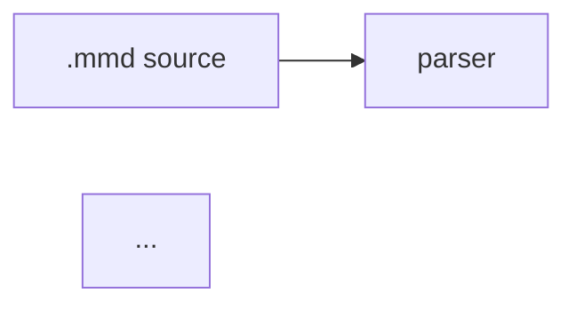

# Graph Deck — Presentation Mode for frankenmermaid

> **Status:** PLANNING (round 1 draft — pending review rounds)
> **Author:** Claude (planning workflow), 2026-08-25
> **Inspiration:** [`yoheinakajima/graphcon-deck`](https://github.com/yoheinakajima/graphcon-deck) — a single-file
> "knowledge-graph presentation engine" shown at GraphCon 2026.
> **Tracking epic (proposed):** `bd-deck` (to be created after plan reaches steady state)

---

## Table of contents

1. [Part I — Vision and motivation](#part-i--vision-and-motivation)
2. [Part II — Design principles and hard constraints](#part-ii--design-principles-and-hard-constraints)
3. [Part III — Architecture overview and key decisions](#part-iii--architecture-overview-and-key-decisions)
4. [Part IV — The deck definition language](#part-iv--the-deck-definition-language)
5. [Part V — IR types (fm-core)](#part-v--ir-types-fm-core)
6. [Part VI — Parser changes (fm-parser)](#part-vi--parser-changes-fm-parser)
7. [Part VII — Scene resolution and manifest building (fm-render-svg)](#part-vii--scene-resolution-and-manifest-building-fm-render-svg)
8. [Part VIII — The DeckManifest schema](#part-viii--the-deckmanifest-schema)
9. [Part IX — WASM surface (fm-wasm)](#part-ix--wasm-surface-fm-wasm)
10. [Part X — CLI surface (fm-cli)](#part-x--cli-surface-fm-cli)
11. [Part XI — The browser deck runtime](#part-xi--the-browser-deck-runtime)
12. [Part XII — Showcase demo section](#part-xii--showcase-demo-section)
13. [Part XIII — Testing strategy](#part-xiii--testing-strategy)
14. [Part XIV — Documentation, claims, changelog](#part-xiv--documentation-claims-changelog)
15. [Part XV — Task breakdown and dependency graph](#part-xv--task-breakdown-and-dependency-graph)
16. [Part XVI — Risks and mitigations](#part-xvi--risks-and-mitigations)
17. [Part XVII — Non-goals and future work](#part-xvii--non-goals-and-future-work)
18. [Appendix A — graphcon-deck schema reference](#appendix-a--graphcon-deck-schema-reference)

---

## Part I — Vision and motivation

### I.1 What graphcon-deck is (self-contained description)

`graphcon-deck` is a ~3,600-line single-file HTML app by Yohei Nakajima. Its core insight:
**a presentation about a graph should itself be one graph, and slides should be camera moves
over it.** Concretely:

- Every node of every "slide" lives at an authored `[x, y]` position on one infinite 2D canvas
  (each slide has an `anchor` offset; node positions are relative to their slide's anchor).
- A slide is: a title + caption + a set of member nodes + optional `include`s of nodes owned by
  other slides + intra-slide edges. A global `connections` list draws cross-slide edges
  (`kind: "cross"` dashed indigo, `kind: "spine"` faint gray).
- On slide change, the camera tweens (lerp, ~0.065/frame) to fit the slide's node bounding box
  with a `fitMargin`, capped at `zoomMax`. Every node **not** in the slide glides out past the
  viewport edge along the ray from the window center ("push-out", eased), so the visible world
  contains only the current scene while the whole graph remains one continuous space.
- Within a slide, nodes carry `step: N`; pressing next reveals step 1, 2, … with a staggered
  connectivity-first animation (a freshly revealed node that connects to something already
  visible appears first).
- The final scene is an **overview**: camera zooms out to the entire graph and a border
  rectangle replays every slide's camera window in a loop ("tour"), with the highlight and
  push-out following the moving window.
- Extras: hover tooltips (`node.tip`), click a dimmed node to travel to its owning slide,
  drag-pan/scroll-zoom free camera (slide navigation restores the tour camera), an edit panel
  (drag nodes to reposition, sliders for fitMargin/pushMargin/zoomMax/floatAmp, undo, JSON
  import/export), gentle idle "float" animation on every node, and styling maps
  (`nodeStyles` / `edgeStyles` keyed by space-separated `kind` tokens).

The deck itself is a JSON object (`meta`, `styling`, `assets`, `layoutDefaults`, `slides`,
`connections`) embedded in the file. There is **no layout engine and no diagram language** —
every position is hand-authored, and the node/edge model is bespoke.

### I.2 Why this belongs in frankenmermaid

frankenmermaid's pipeline already produces everything graphcon-deck had to hand-author, plus
everything it lacked:

| graphcon-deck needs | frankenmermaid already has |
|---|---|
| Hand-authored `[x,y]` for every node | Deterministic layout: 15 algorithms, byte-stable output (`fm-layout`) |
| Bespoke JSON node/edge model | `MermaidDiagramIr` from real Mermaid/DOT source, 24 diagram types |
| Manual grouping via slide ownership | Subgraphs/clusters with a reverse index (`IrGraphNode.subgraphs`, `crates/fm-core/src/lib.rs:1715`) |
| Hand-assigned reveal `step`s | Layout ranks + centrality tiers (`LayoutNodeBox.rank`, `LayoutExtensions.node_centrality`) to derive reveal order automatically |
| Nothing addressable | Stable, deterministic SVG element ids: `fm-node-{sanitized}-{index}`, `fm-edge-{index}`, `fm-cluster-{index}` (`crates/fm-core/src/lib.rs:5992-6057`) plus `data-id` with the author's node id |
| No validation | Parser diagnostics with spans; a typo'd node reference in a slide becomes an actionable warning |
| No CLI / no CI story | Deterministic artifacts → golden-testable manifests; a `deck` subcommand that emits a shareable standalone HTML presentation |

The feature in one sentence: **author a normal Mermaid diagram, add a small `%%{deck: …}%%`
directive naming slides as subsets of the graph, and frankenmermaid computes a deterministic
"deck manifest" (member sets, camera rectangles, reveal steps, element ids) that a ~500-line
dependency-free browser runtime turns into a graphcon-deck-style guided presentation over the
already-rendered SVG.**

This is the "accurate, efficient, cool" split the feature demands:

- **Accurate** — membership, geometry, and reveal order are computed by the engine from the
  real IR and the real layout, in the same invocation that produced the SVG; the manifest and
  the SVG cannot drift because they share one parse + one layout.
- **Efficient** — the browser runtime does zero graph work: no parsing, no layout, no geometry
  math beyond one fit computation per slide. Camera moves are a single composited CSS
  transform. The manifest is precomputed, rounded, and small (a few KB).
- **Cool** — a Mermaid diagram becomes a zoomable, narrated, step-revealed presentation with a
  finale tour, and `frankenmermaid deck talk.mmd -o talk.html` emits a self-contained file you
  can open anywhere, present from, and email to someone.

### I.3 User stories

1. **The conference speaker.** Writes `architecture.mmd` describing their system with
   subgraphs per domain. Adds a deck directive with 8 slides ("the ingest path", "the storage
   tier", "what happens on failure", …). Runs `frankenmermaid deck architecture.mmd -o
   talk.html`. Presents from the HTML file: arrow keys advance reveals and slides, the final
   scene zooms out to the whole system and tours every slide's window. No PowerPoint, no
   Figma, and when the architecture changes they re-run one command.
2. **The docs author.** Embeds the same diagram in their docs site twice: once as a static
   SVG, once wrapped in the deck runtime for a "guided tour" toggle. Because output is
   deterministic, the deck manifest is committed and diffed in PRs like any golden artifact —
   a slide that silently loses a node fails CI.
3. **The showcase visitor.** Scrolls to the new "Graph Deck" section on frankenmermaid.com,
   watches the engine's own architecture present itself, drags/zooms freely, clicks a dimmed
   node and gets teleported to its slide, then clicks "Open in the Operating Theater" to edit
   the deck source live.
4. **The tooling integrator.** Calls `renderDeck(source)` from the WASM API and gets
   `{ svg, manifest }` in one call; builds their own player (VS Code webview, Slack unfurl,
   kiosk display) against the documented manifest schema without touching Rust.

### I.4 Feature parity decision table vs graphcon-deck

| graphcon-deck feature | v1 disposition | Rationale |
|---|---|---|
| Camera fit + tween per slide | ✅ core | The essence of the feature |
| Membership highlight / dim non-members | ✅ core (dim) | See D7: dim instead of push-out |
| Push-out (non-members glide past viewport edge) | ⏭ v2 experiment | Conflicts with `transform` attrs already on SVG node groups; dim achieves the same narrative focus without touching geometry (Part XVII) |
| Reveal steps + staggered connectivity-first entrance | ✅ core | Manifest precomputes per-step element lists; runtime staggers |
| Overview scene + window-replay tour | ✅ core | Signature move; cheap (one animated `<rect>` + the same fit math) |
| Click dimmed node → travel to its slide | ✅ core | Manifest already maps element id → slides containing it |
| Hover tooltips | ✅ core | Free: `IrNode` already carries tooltip metadata (`IrNodeInteraction`, `fm-core/src/lib.rs:1439-1477`); manifest surfaces it |
| Free camera (drag pan / wheel zoom / pinch) | ✅ core | Same interaction model as the showcase's proven `PanZoomController` |
| Cross-slide `include` of other slides' nodes | ✅ trivially subsumed | In frankenmermaid every node belongs to the *diagram*, not to a slide; any slide may reference any node. No special mechanism needed |
| Cross-slide `connections` (spine/cross edges) | ✅ subsumed | All edges belong to the diagram; per-slide edge policy (`induced`/`touching`/`none`) covers it |
| Idle float animation | ✅ optional, off by default | Pure CSS on the runtime side; respects `prefers-reduced-motion` |
| Edit mode (drag nodes, write positions back) | ⏭ future | Positions are computed here, not authored; the meaningful edit surface is the *source text*, which the existing lens system (`diagramLens`/`parseLens`) already owns. See Part XVII |
| Slider panel (fitMargin/zoomMax/…) | ✅ options in the directive | Same knobs, but declared in source so they're versioned and deterministic |
| JSON import/export of the deck | ✅ subsumed | The `.mmd` source *is* the deck; the manifest is the export |
| Bespoke `nodeStyles`/`edgeStyles` maps | ❌ not needed | frankenmermaid themes + `classDef` already style nodes/edges |

---

## Part II — Design principles and hard constraints

These are non-negotiable, sourced from `AGENTS.md`, the codebase, and the investigation.

**C1 — Determinism is voting.** The manifest must be a pure function of `(source, config)`:
`BTreeMap` only, all lists sorted or in stable insertion order, coordinates rounded (2 decimal
places) before serialization, no clock reads, no `HashMap` iteration. Precedent: the
`gantt_today` injection comment (`fm-render-svg/src/lib.rs:191-202`) and the hidden
`determinism-manifest` subcommand which hard-fails on non-finite values.

**C2 — One parse, one layout.** SVG and manifest must come from the same IR + layout instance.
Never parse or lay out twice to build a deck: that doubles cost and creates a drift surface.

**C3 — Never waste user intent.** Deck errors degrade, not fail: an unknown node selector is a
warning diagnostic with a span and the slide keeps its other members; an empty slide is dropped
with a warning; a deck with zero valid slides means "no manifest" plus diagnostics, never a
parse failure. This mirrors the parser-recovery philosophy in README "Design philosophy" §1.

**C4 — No file proliferation; new files only for genuinely new functionality.** New Rust files
allowed by this plan: `crates/fm-render-svg/src/deck.rs` (new subsystem),
`crates/fm-cli/src/deck_template.html` (asset), `web/fm-deck-runtime.js` (new browser
subsystem), `scripts/verify_deck_runtime.mjs` (guard). Everything else is edited in place.
No `*_v2.rs`, no shims.

**C5 — Zero unsafe, clippy pedantic+nursery, `-D warnings`, nightly 2024 edition.** All new
code passes `cargo check/clippy/fmt/test --workspace`.

**C6 — WASM-safe by construction.** The deck directive uses the `%%{…}%%` channel (already
JSON5-parsed and wasm-safe), **not** YAML front matter (unavailable on wasm32,
`mermaid_parser.rs:11997-12005`). No `std::time::Instant` in any new path.

**C7 — The showcase is hand-edited and guarded.** `index.html` and
`frankenmermaid_demo_showcase.html` are byte-identical copies — every edit lands in both.
`DIAGRAM_SAMPLES` (between `// >>> demo-samples:start/end`) is verified by
`scripts/verify_demo_samples.mjs` to contain exactly one sample per family — **the demo deck
source must live outside those markers.** The presenter stub (`#section-presenter`,
`#presenter-step`, `#presenter-summary`, `#presenter-start`, `?tour=` behavior) is asserted by
the test harness and must survive untouched.

**C8 — Deploy via Wrangler only; never GitHub Actions.** New static assets must be added to
the Wrangler recipe in `AGENTS.md` (the `dist/site` assembly block). Do not create, edit, or
rely on workflow files.

**C9 — Layout cache must not see the deck.** Deck metadata lives on `MermaidDiagramIr`
directly, **not** on `MermaidDiagramMeta` (which derives `Eq` and keys the incremental-layout
memo). Editing slide definitions must never invalidate a cached layout, because the deck is
consumed strictly after layout. This is both a correctness nicety and a real UX win in
watch/live-edit flows: retitling a slide re-renders without re-laying-out.

**C10 — Security: deck text is untrusted.** Slide titles/captions/tooltips reach the DOM. The
browser runtime uses `textContent` exclusively (never `innerHTML`) for deck-sourced strings;
the CLI HTML template escapes them with the existing XML-escape functions. No link/URL fields
in v1 (nothing to sanitize).

**C11 — Public API stays narrow.** The wasm-bindgen surface is "intentionally narrow" (README).
One new export (`renderDeck`) rather than three partial ones.

**C12 — Capability claims are executable.** The new surfaces register in
`fm-core::surface_capability_claims()` (`crates/fm-core/src/lib.rs:633`) with evidence refs, so
`fm-cli capabilities` and the README generated block stay truthful.

---

## Part III — Architecture overview and key decisions

### III.1 Dataflow

```
 .mmd source ──► fm-parser ──────────────► MermaidDiagramIr
   (contains        │ parses %%{deck:…}%%      │  .deck: Option<Box<IrDeck>>   (selectors, raw)
    %%{deck:…}%%)   │ (syntactic checks)       │
                    └─ post-parse semantic     ▼
                       validation of        fm-layout ────► DiagramLayout      (deck-blind; C9)
                       selectors               │               │
                                               ▼               ▼
                                        fm-render-svg ┌─────────────────────┐
                                               │      │ deck.rs             │
                                               ▼      │  resolve scenes     │
                                          SVG string  │  induce edges       │
                                       (stable ids)   │  assign steps       │
                                               │      │  union bounds       │
                                               │      │  → viewBox space    │
                                               │      └──────────┬──────────┘
                                               │                 ▼
                                               │           DeckManifest (serde, fm-core types)
                                               │                 │
              ┌────────────────────────────────┴────────┬────────┴──────────────┐
              ▼                                         ▼                       ▼
        fm-wasm renderDeck()                 fm-cli deck subcommand      fm-cli render
        → { svg, manifest }                  → standalone talk.html      --deck-manifest-out
              │                                (svg + manifest +         → deck.json artifact
              ▼                                 embedded runtime)
        showcase #deck section  ◄──────────────────┐
              │                                    │
              └────────────► web/fm-deck-runtime.js (single canonical copy;
                             CLI embeds via include_str!; showcase inlines a
                             marker-fenced copy guarded by verify_deck_runtime.mjs)
```

### III.2 Key decisions (each with rationale)

**D1 — Slides are declared in the Mermaid source via `%%{deck: …}%%` directives, not a
sidecar file.**
*Why:* (a) the directive channel already exists, is JSON5-tolerant, wasm-safe, and one
whitelist line away (`extract_config_directive_payload`, `mermaid_parser.rs:12213-12225`,
currently `init` | `constraints`); (b) a sidecar file cannot work in the browser WASM path or
the live-editor showcase, where there is exactly one text buffer; (c) co-locating slides with
the diagram keeps them versioned, diffable, and impossible to orphan. The `constraints`
directive is the exact precedent — including its "parse before body, resolve references later"
contract (`parse_layout_constraint_config` doc comment, `mermaid_parser.rs:12090-12096`).
A sidecar/JS-object input can be added later for programmatic decks (Part XVII) without
changing the manifest.

**D2 — Deck directives are always parsed (not gated by `enable_init_directives`).**
*Why:* the `enable_init_directives` gate exists because init directives change *rendering
config* (themes, security level) and are therefore a trust decision. Deck definitions are
*structural content* — they name subsets of the graph and add no links, scripts, styles, or
config. Verified: `parse_init_directives` (`mermaid_parser.rs:11957`) is not gated in the
parser; gating applies downstream when init *config* is honored. `constraints` follows this
exact model. C10 covers the only injection surface (text → DOM).

**D3 — Deck metadata hangs off `MermaidDiagramIr` (`deck: Option<Box<IrDeck>>`), not
`MermaidDiagramMeta`.**
*Why:* C9 (Eq-keyed layout memo must stay deck-blind), plus `IrDeck` wants `f32` option knobs
(fitMargin) which would break `MermaidDiagramMeta: Eq`. Follows the boxed-optional pattern of
`class_meta`/`c4_meta` fields. Must be added to `MermaidDiagramIr::empty()`
(`fm-core/src/lib.rs:5164-5205` enumerates every field explicitly) and gets
`#[serde(default, skip_serializing_if = "Option::is_none")]` so existing IR JSON round-trips
byte-identically for deckless diagrams (protects `parse --full` goldens and the serde
round-trip property test).

**D4 — Scene resolution + manifest building live in a new `crates/fm-render-svg/src/deck.rs`
module; manifest *types* live in `fm-core`.**
*Why the split:* the manifest must express camera rectangles in **SVG viewBox space**, and the
layout→viewBox offsets are private locals of the SVG renderer (`offset_x = padding - bounds.x`,
`offset_y = padding - bounds.y + title_height`, `fm-render-svg/src/lib.rs:3977-3978`). Building
the manifest next to those constants — after refactoring them into one shared helper (D5) —
makes drift structurally impossible. Types go in `fm-core` beside `MermaidSourceMap`
(`fm-core/src/lib.rs:5437-5539`, the existing precedent for "serde manifest keyed by element
id") so `fm-wasm` and `fm-cli` can name them without depending on renderer internals, and so
`fm-render-term`/`fm-render-canvas` could emit the same manifest later. Nothing in `fm-layout`
is `Serialize` (verified: `DiagramLayout` and friends derive only `Debug, Clone, PartialEq`),
so serde mirror types were required anyway.

**D5 — Refactor the SVG frame math into one shared function.**
Extract `fn svg_frame(ir, layout, config) -> SvgFrame { viewbox_width, viewbox_height,
offset_x, offset_y, title_height, legend_inset }` used by both `render_layout_to_svg`
(`fm-render-svg/src/lib.rs:3720`) and `deck.rs`. *Why:* today the viewBox math (padding,
title band, C4 legend inset) is inlined; two consumers computing it independently is exactly
the "manifest disagrees with SVG by one title-height" bug class. One function, two callers,
one golden test asserting the SVG viewBox equals the manifest's `viewBox` field.

**D6 — The browser camera is a CSS transform on a wrapper, not `viewBox` animation.**
*Why:* animating `viewBox` re-lays-out the whole SVG every frame — measurably slow on
1,000+-element diagrams, and this engine's pitch is *large* graphs. The showcase's proven
`PanZoomController` (`index.html:3306-3538`) already implements the exact pattern:
`.pan-zoom-container > .pan-zoom-viewport` with `transform: translate3d(…) scale(…)`,
`transform-origin: 0 0`, rAF-coalesced writes. The deck runtime uses the same DOM contract
(and the same dot-grid stage styling) but owns its own tweening (slide-fit targets with
ease-in-out, graphcon's `easeIO` cubic), because `PanZoomController` has no notion of animated
targets. Free-cam drag/wheel reuses the identical math.

**D7 — v1 focus choreography is dim, not push-out.**
*Why:* graphcon's push-out translates each non-member node; frankenmermaid's SVG node groups
already carry `transform="translate(…)"` attributes, and stacking a second animated transform
per element means either rewriting attributes per frame (layout thrash, goldens unaffected but
runtime cost high) or CSS transform overrides (which *replace* the attribute transform per the
SVG2 cascade — breaking positions). Dimming (`opacity` transition on `.fm-deck-dim`, injected
class, default opacity 0.07, configurable) reads nearly identically at presentation distance,
costs one class toggle per element per slide change, and — crucially — never mutates geometry,
so hit-testing, tooltips, and travel-clicks stay correct. Push-out returns as a v2 experiment
behind an option (Part XVII) once measured.

**D8 — One combined WASM export: `renderDeck(input, config) → { svg, manifest, warnings }`.**
*Why:* C2 (one parse, one layout) and C11 (narrow surface). A separate `deckManifest()` would
either re-parse or force a stateful handle API. The export is `cfg_attr`-gated like every
existing export (`fm-wasm/src/lib.rs:1443` pattern) so it is natively testable, and it returns
`null` manifest + warnings when the source has no deck directive — callers can use it as a
strict superset of `renderSvg`.

**D9 — CLI: a new `deck` subcommand whose headline output is a *self-contained presentation
HTML*, plus a `--manifest-out` JSON artifact.**
*Why the HTML:* it is the feature's "demo of the demo" — one command turns a `.mmd` into a
file you can present from, matching the repo's pattern of shipping complete experiences (the
showcase) rather than SDKs. Template embedded via `include_str!` with `{{TITLE}}/{{SVG}}/
{{MANIFEST}}/{{RUNTIME}}/{{CSS}}` placeholders and plain string replacement (no templating
dependency — C5, and dependency additions need justification here). *Why also the JSON
artifact:* CI/golden flows and third-party players need the raw manifest; follows the
`--source-map-out` pattern exactly (`fm-cli/src/main.rs:4998-5012`).

**D10 — Single canonical runtime file, `web/fm-deck-runtime.js`, embedded twice.**
*Why:* three consumers need the runtime (CLI template, showcase section, future npm package).
The CLI embeds it at compile time via `include_str!` (zero drift). The showcase must stay
self-contained (its `./pkg/` loader gymnastics prove how hostile multi-URL-prefix script
loading is — four fallback candidates at `index.html:3545-3623`), so it carries an **inline
copy between `// >>> deck-runtime:start/end` markers**, and a new
`scripts/verify_deck_runtime.mjs` asserts the fenced block is byte-identical to the canonical
file — the same guard architecture as `verify_demo_samples.mjs`. This is the one deliberate
duplication in the plan, and it is machine-checked.

**D11 — Reveal order can be authored (`reveal: [[…], […]]`) or derived (`reveal: "auto"`).**
*Why auto matters:* it is the moment the layout engine visibly out-does graphcon-deck — the
engine already knows ranks (`LayoutNodeBox.rank`) and centrality tiers
(`LayoutExtensions.node_centrality`), so "build up this subsystem in dependency order" is free
for the author. Auto ordering: group members by rank ascending; tie-break by centrality tier
(high first) then `node_index`. Deterministic by construction.

**D12 — Edges are never named by authors; they are derived per slide by policy.**
*Why:* IR edges have no author-visible id (only `edge_index`), and graphcon's experience shows
authors think in nodes. Policy `edges: "induced"` (default — both endpoints in the member set),
`"touching"` (≥1 endpoint; the off-slide endpoint stays dimmed), or `"none"`. Covers
graphcon's `connections` use cases without a second edge vocabulary.

---

## Part IV — The deck definition language

### IV.1 Syntax

One or more `%%{deck: { … }}%%` directives anywhere in the source (conventionally at the top,
after the header). Payload is JSON5 (unquoted keys, trailing commas, single quotes OK —
`parse_init_payload_value` already falls back to JSON5, `mermaid_parser.rs:12227`).



Multiple deck directives **merge in document order**: `title`/`options`/`overview` use
last-writer-wins per key; `slides` arrays concatenate. *Why:* lets authors co-locate a slide
definition next to the diagram region it narrates in long files, mirroring how `constraints`
directives may appear anywhere.

### IV.2 Grammar (all keys, all defaults)

```
deck        := { title?, options?, slides, overview? }
title       : string                      — deck title (runtime header, HTML <title>)
options     := {
  fitMargin  : number  (default 150)      — world-space padding around slide bounds
  zoomMax    : number  (default 1.4)      — max device-px per SVG unit when fitting
  dimOpacity : number  (default 0.07)     — opacity of non-member elements, clamp [0,1]
  floatAmp   : number  (default 0)        — idle float amplitude in px; 0 disables
  autoAdvanceMs : number (default 0)      — kiosk autoplay; 0 disables
}
slides      := [ slide+ ]                 — 1..=64 slides (cap: see IV.5)
slide       := {
  id        : string   (required)         — unique; used in URLs and diagnostics
  title     : string   (default id)
  caption   : string   (default "")
  nodes     : [ selector+ ] (required)    — member selectors, see IV.3
  reveal    : "auto" | [ [selector+]+ ]  (default: none — all members at step 0)
  edges     : "induced" | "touching" | "none"   (default "induced")
  fitMargin : number   (overrides options.fitMargin)
  zoomMax   : number   (overrides options.zoomMax)
}
overview    := {
  title     : string  (default "Overview")
  caption   : string  (default "")
  tour      : bool    (default true)      — replay slide windows with the border rect
  enabled   : bool    (default true)      — false: no auto-appended overview scene
}
selector    := node-id                    — exact author node id, e.g. "parser"
             | "subgraph:" key            — all member nodes of subgraph `key`,
                                            including nested descendants
             | "*"                        — every node in the diagram
```

### IV.3 Selector semantics

- **Node id** — matched against `IrNode.id` exactly (case-sensitive, like the rest of the
  language). Implicit (auto-created placeholder) nodes are selectable like any other.
- **`subgraph:KEY`** — resolves via `MermaidGraphIr::subgraphs_by_key` +
  `subgraph_descendants` (`fm-core/src/lib.rs:1771,1849`), unioning `members` of the subgraph
  and every descendant. *Why descendants:* an author pointing at a container means "this whole
  region"; excluding nested children would make every C4/architecture deck tediously explicit.
- **`*`** — all nodes. Exists so an author can write a custom overview-style slide mid-deck
  ("here's everything again, but now look at this corner" via a follow-up slide).
- Duplicate resolution is a set union; order of `nodes` does not affect membership (but does
  affect nothing else either — determinism comes from sorted node indexes, Part VII).

### IV.4 Validation diagnostics (all Warning severity, category `Semantic`, with the
directive's span)

| Condition | Behavior |
|---|---|
| Unknown node id / subgraph key in `nodes` or `reveal` | Warn `deck: slide 'X': unknown selector 'Y'` + suggestion via existing fuzzy machinery if an id within Levenshtein ≤2 exists; selector ignored |
| Slide resolves to zero members | Warn; slide dropped from manifest |
| Duplicate slide id | Warn; second occurrence gets `-2` suffix (never dropped — C3) |
| `reveal` selector not in the slide's member set | Warn; selector ignored in steps (still a member if listed in `nodes`) |
| Member in `nodes` but never in any `reveal` group (when reveal is authored) | Silently step 0 (visible from slide entry) — this is the intended way to have an "always there" anchor node |
| Deck present but `slides` empty/absent | Warn `deck: no slides defined`; no manifest emitted |
| Payload not an object / `slides` not an array / wrong types | Init-error diagnostic (existing `add_init_error` path); directive ignored |
| Numeric options out of range (negative margins, dimOpacity ∉ [0,1], >64 slides) | Warn; clamped (margins to ≥0, opacity into [0,1], slides truncated to 64) |

*Why warnings and not errors:* C3. The diagram must still render as a plain SVG even when the
deck block is broken; `fm-cli validate --fail-on warning` remains the CI escalation path.

### IV.5 Limits

`MAX_DECK_SLIDES = 64`, `MAX_SELECTORS_PER_SLIDE = 512`, title/caption truncated at
`max_label_chars`-style cap of 512 chars. *Why:* directives are attacker-reachable input
(pasted diagrams); resolution is O(slides × selectors × log n) and these caps keep the worst
case trivial while being far above any real presentation.

---

## Part V — IR types (fm-core)

New types in `crates/fm-core/src/lib.rs` (placed beside `MermaidSourceMap`):

```rust
/// Raw deck definition as parsed from `%%{deck: …}%%` directives.
/// Selectors are stored unresolved (strings) because directives parse before the
/// diagram body — same contract as layout constraints. Resolution happens post-parse
/// (validation) and at manifest-build time (fm-render-svg::deck).
#[derive(Debug, Clone, PartialEq, Serialize, Deserialize)]
pub struct IrDeck {
    pub title: Option<String>,
    pub options: IrDeckOptions,
    pub slides: Vec<IrDeckSlide>,
    pub overview: IrDeckOverview,
    /// Span of the first deck directive — anchor for deck-level diagnostics.
    pub span: Span,
}

#[derive(Debug, Clone, PartialEq, Serialize, Deserialize)]
pub struct IrDeckOptions {
    pub fit_margin: f32,      // default 150.0
    pub zoom_max: f32,        // default 1.4
    pub dim_opacity: f32,     // default 0.07
    pub float_amp: f32,       // default 0.0
    pub auto_advance_ms: u32, // default 0
}

#[derive(Debug, Clone, PartialEq, Serialize, Deserialize)]
pub struct IrDeckSlide {
    pub id: String,
    pub title: String,
    pub caption: String,
    pub nodes: Vec<String>,               // raw selectors
    pub reveal: IrDeckReveal,
    pub edges: IrDeckEdgePolicy,
    pub fit_margin: Option<f32>,
    pub zoom_max: Option<f32>,
    pub span: Span,                       // span of the declaring directive line
}

#[derive(Debug, Clone, PartialEq, Serialize, Deserialize)]
pub enum IrDeckReveal { None, Auto, Groups(Vec<Vec<String>>) }

#[derive(Debug, Clone, Copy, PartialEq, Eq, Serialize, Deserialize)]
#[serde(rename_all = "lowercase")]
pub enum IrDeckEdgePolicy { Induced, Touching, None }

#[derive(Debug, Clone, PartialEq, Serialize, Deserialize)]
pub struct IrDeckOverview {
    pub enabled: bool,        // default true
    pub title: String,        // default "Overview"
    pub caption: String,
    pub tour: bool,           // default true
}
```

`MermaidDiagramIr` gains:

```rust
#[serde(default, skip_serializing_if = "Option::is_none")]
pub deck: Option<Box<IrDeck>>,
```

with `deck: None` added to `MermaidDiagramIr::empty()`. `Box` keeps the always-present IR
small for the 99% of diagrams with no deck (same reasoning as `IrNodeInteraction` boxing).

The **manifest** types (`DeckManifest`, …) also live in fm-core — full schema in Part VIII.

---

## Part VI — Parser changes (fm-parser)

All in `crates/fm-parser/src/mermaid_parser.rs` + `ir_builder.rs`, following the
`constraints` template.

1. **Whitelist** — `extract_config_directive_payload` (`:12220`): add
   `|| directive.eq_ignore_ascii_case("deck")`.
2. **Routing** — in `parse_init_directives` (`:11983-11990` region): when the directive is
   `deck`, call a new `parse_deck_config(&parsed_value, context, span, builder)` instead of
   wrapping into `apply_mermaid_config_value`.
3. **`parse_deck_config`** — modeled on `parse_layout_constraint_config`
   (`:12096`): validates shape, warns on unknown keys (`builder.add_warning`), clamps numeric
   ranges (IV.4), constructs/merges `IrDeck` into a new `IrBuilder` field
   (`deck: Option<IrDeck>`), which the builder's finish step moves onto the IR. Merging rule
   per IV.1. Type errors route through `add_init_error` (existing machinery, so
   `fm-cli validate` reports them under the same category as malformed init payloads).
4. **Post-parse semantic validation** — after the diagram body has been parsed (node ids now
   known), alongside `apply_semantic_recovery()`: resolve every selector purely for
   *diagnostic* purposes (IV.4 table) using the built node-id set and subgraph keys. Fuzzy
   suggestion reuses the existing Levenshtein helper the detector uses. The resolved sets are
   **not** stored — resolution happens again (cheaply, against the same IR) at manifest time.
   *Why not store them:* storing `Vec<IrNodeId>` on the IR would duplicate truth (raw + resolved)
   and go stale under lens edits; resolution is O(selectors·log n) and free at manifest scale.
5. **Format complement** — `%%{deck:…}%%` lines already classify as directive spans in
   `capture_format_complement` (`lib.rs:2190-2194`), so lens round-trips preserve them
   verbatim with zero extra work. Add a test proving it.

Not touched: detection, body parsers, DOT bridge (a DOT input can still get a deck via
directives? — **no**: DOT input takes the `parse_dot` branch which never scans Mermaid
directives. Documented limitation in v1; revisit in Part XVII).

---

## Part VII — Scene resolution and manifest building (fm-render-svg)

New module `crates/fm-render-svg/src/deck.rs`. Public entry points:

```rust
/// Build the deck manifest for a diagram, or None when `ir.deck` is absent
/// or resolves to zero valid slides. Pure function; deterministic.
pub fn deck_manifest(
    ir: &MermaidDiagramIr,
    layout: &DiagramLayout,
    config: &SvgRenderConfig,
) -> Option<DeckManifest>;

/// Render SVG and manifest from one shared frame computation (C2/D5).
pub fn render_svg_with_deck(
    ir: &MermaidDiagramIr,
    layout: &DiagramLayout,
    config: &SvgRenderConfig,
) -> (String, Option<DeckManifest>);
```

### VII.1 Frame refactor (D5)

Extract from `render_layout_to_svg` (`lib.rs:3720`) into:

```rust
pub(crate) struct SvgFrame {
    pub viewbox_width: f32,
    pub viewbox_height: f32,
    pub offset_x: f32,     // svg_x = layout_x + offset_x
    pub offset_y: f32,     // svg_y = layout_y + offset_y
}
pub(crate) fn svg_frame(ir: &MermaidDiagramIr, layout: &DiagramLayout,
                        config: &SvgRenderConfig) -> SvgFrame;
```

`render_layout_to_svg` must produce **byte-identical output** after this refactor — the ~45
SVG goldens are the proof, and this refactor lands as its own commit *before* any deck logic
so a golden diff bisects cleanly.

### VII.2 Membership resolution

For each slide, in declaration order:

1. Resolve selectors → `BTreeSet<usize>` of node indexes (node id map built once per manifest:
   `BTreeMap<&str, usize>` over `ir.nodes`; subgraph selectors via
   `graph.subgraphs_by_key` + `subgraph_descendants`; `*` → all). Unknown selectors were
   already warned at parse time; here they are silently skipped (never warn twice).
2. Drop the slide if empty (parse-time warning already emitted).
3. **Edges** per policy (D12): iterate `layout.edges` (which carry `edge_index`); resolve each
   edge's endpoints via `ir.edges[edge_index]` endpoints → node indexes
   (`resolve_endpoint_node`); include per policy. Port-rooted edges (ER/class) resolve to
   their parent node — an entity's membership implies its attribute edges.
4. **Clusters**: include `layout.clusters[i]` when ≥1 member node of the underlying cluster is
   in the slide set. *Why ≥1 not all:* a slide about "the parser half of the pipeline
   subgraph" should still show its containing box (dimmed context comes from the runtime
   dimming non-member *nodes*; the cluster chrome anchors the region).

### VII.3 Step assignment

- `IrDeckReveal::None` → every member at step 0; `max_step = 0`.
- `Groups(g)` → group k (1-based) assigns step k to each resolved member of that group's
  selectors ∩ slide members; unlisted members are step 0.
- `Auto` (D11) → members sorted by `(rank, centrality_desc, node_index)` using
  `LayoutNodeBox.rank` and `LayoutExtensions.node_centrality` (tier absent → Medium); then
  grouped by rank: each distinct rank among members becomes one step, in ascending rank order,
  except the first rank which is step 0. *Why rank-grouped rather than one-node-per-step:*
  a 40-node slide should not need 40 keypresses; ranks are the natural "waves" of a layered
  layout. (For non-Sugiyama layouts rank is still populated per `LayoutNodeBox`, so the rule
  is total.)
- **Edge steps** are derived, not authored: an edge's step = max(step of its endpoints)
  (touching edges with an off-slide endpoint use the on-slide endpoint's step). The manifest
  precomputes per-step reveal lists so the runtime never re-derives this.

### VII.4 Camera bounds

Per slide: union of (member node `bounds`, included cluster `bounds`, all points of included
edges' `points`) — the same union set as the private `compute_bounds`
(`fm-layout/src/lib.rs:17561`) so slide frames feel consistent with the diagram frame; then
convert to viewBox space via `SvgFrame` offsets and round to 2 decimals. The manifest stores
the **tight** rect; `fitMargin`/`zoomMax` ship as numbers for the runtime to apply (Part VIII
rationale: fit depends on the viewer's pixel viewport, which the engine cannot know).

Overview scene camera = full viewBox rect. Tour windows = each slide's tight rect (runtime
applies margins the same way, so the tour rect matches what the visitor saw on that slide).

### VII.5 Determinism rules (C1)

- All sets are `BTreeSet<usize>`; all emitted lists sorted by index; steps ascending.
- Coordinates rounded to 2 dp via `(x * 100.0).round() / 100.0` before serialization
  (mirrors the 6-dp canonicalization of layout checksums, but 2 dp because these are
  presentation rects, and shorter JSON matters for the embedded showcase/CLI payloads).
- Two consecutive `deck_manifest` calls on the same inputs must produce byte-identical
  `serde_json::to_string` output — a required unit test.

---

## Part VIII — The DeckManifest schema

Serde types in fm-core; `#[serde(rename_all = "camelCase")]` (matching `WasmRenderOutput` /
`SourceSpanRecord` precedent). `schemaVersion` uses semver-as-string so external players can
gate.

```jsonc
{
  "schemaVersion": "1.0.0",
  "generator": "frankenmermaid",
  "diagramType": "flowchart",
  "title": "How frankenmermaid works",        // deck title or null
  "viewBox": { "x": 0, "y": 0, "width": 1892.4, "height": 1104.0 },
  "options": { "fitMargin": 140, "zoomMax": 1.4, "dimOpacity": 0.07,
               "floatAmp": 0, "autoAdvanceMs": 0 },
  "slides": [
    {
      "id": "intro",
      "title": "One shared IR",
      "caption": "every parser writes it, every renderer reads it",
      "bounds": { "x": 40.0, "y": 262.5, "width": 612.2, "height": 341.0 },
      "fitMargin": 140,                        // resolved (slide override or deck default)
      "zoomMax": 1.4,
      "nodes": [                               // sorted by index
        { "index": 0, "sourceId": "src",    "elementId": "fm-node-src-0",    "step": 0,
          "tooltip": null },
        { "index": 3, "sourceId": "parser", "elementId": "fm-node-parser-3", "step": 1,
          "tooltip": "Detection + parsing + recovery" }
      ],
      "edges":    [ { "index": 2, "elementId": "fm-edge-2", "step": 1, "touching": false } ],
      "clusters": [ { "index": 0, "elementId": "fm-cluster-0" } ],
      "maxStep": 2,
      "steps": [                               // precomputed reveal lists, step 1..=maxStep
        { "step": 1, "elementIds": ["fm-node-parser-3", "fm-edge-2"] },
        { "step": 2, "elementIds": ["fm-node-ir-5", "fm-edge-4"] }
      ]
    }
  ],
  "overview": { "enabled": true, "title": "One graph", "caption": "…", "tour": true },
  "nodeSlideIndex": {                          // elementId → slide ids containing it
    "fm-node-parser-3": ["intro", "layout"]    // powers click-to-travel in O(1)
  }
}
```

Notes:

- `elementId` strings are emitted via the *same* fm-core id functions the renderer uses
  (`mermaid_node_element_id` etc.) — the join key contract. A property test asserts every
  manifest `elementId` occurs verbatim in the SVG string (Part XIII).
- `tooltip` surfaces `IrNode` tooltip metadata so the runtime shows graphcon-style tips with
  zero extra plumbing; `null` when absent.
- `steps[].elementIds` exist so the runtime's advance() is an array walk (efficiency; also
  keeps edge-step derivation logic in exactly one place, the engine).
- `touching: true` marks edges whose far endpoint is off-slide (runtime renders them at 50%
  of active opacity, echoing graphcon's `half` edge state).
- `nodeSlideIndex` is a `BTreeMap` — sorted, deterministic.

---

## Part IX — WASM surface (fm-wasm)

One new export in `crates/fm-wasm/src/lib.rs`, following the `render_svg_js` pattern
(`:1443`):

```rust
#[derive(Serialize)]
#[serde(rename_all = "camelCase")]
struct WasmDeckOutput {
    svg: String,
    manifest: Option<fm_core::DeckManifest>,
    warnings: Vec<String>,
}

#[cfg_attr(target_arch = "wasm32", wasm_bindgen(js_name = renderDeck))]
pub fn render_deck_js(input: &str, config: Option<JsValue>) -> Result<JsValue, JsValue> {
    // parse once, layout once, render_svg_with_deck once (C2)
    // reuse the same config plumbing as render_svg_js
    // to_js_value(&WasmDeckOutput { .. })
}
```

- Native-callable (cfg_attr) → unit-testable without a browser.
- `manifest: None` + a warning when no deck directive exists — callers treat `renderDeck` as a
  superset of `renderSvg` (D8).
- `build-wasm.sh` unchanged; expected size impact is small (deck.rs is set arithmetic), but
  the 500 KB gzip ceiling remains the enforcement and a size check runs before merge.
- TypeScript: the generated `.d.ts` will type the return as `any`; add a documented
  `DeckManifest` TS interface in the README's WASM section (the package README is the API doc
  of record today).

---

## Part X — CLI surface (fm-cli)

### X.1 `fm-cli deck`

New `Command::Deck` variant (after `Validate`, `main.rs:~493`), options struct
`DeckCommandOptions<'a>` beside `ValidateCommandOptions` (`:2912`), handler `cmd_deck`:

```
fm-cli deck input.mmd -o talk.html          # standalone presentation HTML (default format)
fm-cli deck input.mmd --manifest-out d.json # also (or only) write the manifest artifact
fm-cli deck input.mmd --format json         # manifest to stdout / -o
fm-cli deck - < input.mmd                   # stdin, like every other subcommand
Flags shared with render: --theme, --parse-mode, --layout-algorithm, --config, -W/-H,
--font-size, plus --pretty for JSON.
```

Behavior:

- No deck directive → exit 1 with an actionable error:
  `input has no %%{deck: …}%% directive; see 'Deck definitions' in the README` (+ the docs
  example). *Why hard error here when the library degrades:* the user explicitly asked for a
  deck; silently emitting a slideless page violates least surprise. (`render` never errors on
  deckless input — asymmetry is intentional and documented.)
- Deck present but all slides invalid → exit 1, printing the deck diagnostics.
- Emits deck warnings to stderr via the standard diagnostic printer, exit 0 when a usable
  manifest exists.

### X.2 The standalone HTML template

`crates/fm-cli/src/deck_template.html`, embedded via `include_str!`, placeholders
`{{TITLE}} {{SVG}} {{MANIFEST_JSON}} {{RUNTIME_JS}} {{THEME_BG}}` filled by plain
`str::replace`. Content: minimal dark chrome (stage, slide card, prev/next, dots, counter,
"whole graph" button, keyboard hints) — a distilled ~150-line skin over the runtime, visually
neutral (not the showcase's monster theme — this file represents the *user's* talk).
`{{MANIFEST_JSON}}` is embedded inside a `<script type="application/json">` block and read
via `textContent` + `JSON.parse` (avoids `</script>` escaping pitfalls except the standard
`<\/script` guard, which the writer applies). All deck strings XML-escaped (C10).

### X.3 `fm-cli render --deck-manifest-out <path>`

Optional flag on the existing render command following `--source-map-out` verbatim
(`:4998-5012` write pattern; guard: SVG format only; `--json` render payload gains
`deck_manifest_slide_count` + `deck_manifest_out` fields). *Why both surfaces:* `deck` is the
product feature; `render --deck-manifest-out` composes with existing render pipelines
(batch renders, golden flows) without a second subcommand invocation.

---

## Part XI — The browser deck runtime

`web/fm-deck-runtime.js` — ES module, zero dependencies, ~450-550 lines, also assigns
`window.FmDeckRuntime` for non-module embedding (the CLI template). Budget: ≤ 20 KB raw.

### XI.1 Public API

```js
const deck = FmDeckRuntime.mount({
  stage,              // HTMLElement; runtime creates .fm-deck-viewport wrapper inside
  svg,                // string (innerHTML'd once by the runtime) or an <svg> Element
  manifest,           // parsed DeckManifest object
  ui: { card, dots, counter, prevBtn, nextBtn, overviewBtn },  // optional host-provided els
  onSlideChange(i, slide) {},   // host hook (URL sync, analytics)
});
deck.next(); deck.prev(); deck.go(i); deck.overview();
deck.destroy();       // removes listeners, cancels rAF
```

The runtime *manages* provided UI elements rather than creating chrome, so the showcase and
the CLI template each keep their own design language while sharing 100% of the behavior.

### XI.2 Behavior spec

- **Camera** (D6): wrapper div `transform: translate3d(tx,ty,0) scale(s)`,
  `transform-origin: 0 0`, rAF loop lerping toward the target (factor 0.085/frame like
  graphcon; snap when |Δ| < 0.1px). Fit: given slide `bounds` + `fitMargin` + stage px size,
  `s = min(vw/(w+2m), vh/(h+2m), zoomMax)`, centered. Loop **parks** (cancels rAF) once camera
  and dim transitions settle and no tour/float is active — a background showcase section must
  not burn frames (the showcase already worries about paint cost; see its every-other-frame
  edge redraws note in graphcon and the miniature idle-queue).
- **Focus** (D7): one injected `<style>` block:
  `.fm-deck-dim { opacity: var(--fm-deck-dim, .07); } .fm-deck-half { opacity: .45; }`
  with `transition: opacity .5s ease`. On scene apply: toggle `fm-deck-dim` on every
  registered element not in the scene, `fm-deck-half` on touching edges. Elements are
  resolved **once** at mount into `Map<elementId, Element>` (`getElementById` per manifest
  id) — O(n) once, O(members) per slide after.
- **Steps**: `advance()` = next step until `maxStep`, else next slide (graphcon's exact
  model). Steps ≥ current are hidden via `.fm-deck-hidden { opacity: 0 }`. Stagger: reveal the
  step's `elementIds` at 90 ms intervals, nodes before edges (list order is engine-sorted;
  connectivity-first ordering is precomputed by the engine — nodes ascend by rank already).
- **Overview + tour**: camera fits `viewBox`; if `tour`, an appended
  `<rect class="fm-deck-tour">` (inside the SVG root, stroke emerald, `rx` scaled by 1/s)
  tweens between slide windows on a 700 ms move / 900 ms pause cycle, with the dim state
  following the toured slide. Entering any slide removes the rect.
- **Free camera**: pointer drag pans, wheel zooms about the cursor (exact math of
  `PanZoomController.zoomAt`), pinch on touch; any of these sets `freeCam = true` (tween
  suspends). Next/prev/go re-engages the guided camera. Double-click background = refit.
- **Travel**: click on a dimmed member element → `manifest.nodeSlideIndex[elementId][0]` →
  `go(slideIndex)`. Click on an active node with a tooltip → toggle tooltip (positioned like
  graphcon's, clamped to stage).
- **Keyboard**: listener on the **stage element** (stage gets `tabindex="0"`), not window;
  `ArrowRight`/`Space` advance, `ArrowLeft` back, `o` overview, `Home`/`End` first/last;
  `stopPropagation()` so the showcase's global spotlight arrows never double-fire (the
  showcase's window handler at `index.html:4363-4386` claims bare arrows).
- **Reduced motion**: `matchMedia("(prefers-reduced-motion: reduce)")` → camera snaps
  (no tween), stagger collapses to instant, float/tour-motion disabled (tour steps become
  discrete). This also finally adds a real `prefers-reduced-motion` consumer the harness
  expects (§XII.5).
- **Resize**: `ResizeObserver` on the stage → refit current scene (unless freeCam).
- **A11y**: stage `role="region"`, `aria-roledescription="slideshow"`,
  `aria-label` = deck title; slide changes announce title+caption into a visually-hidden
  `aria-live="polite"` element; all deck text via `textContent` (C10).

### XI.3 Float (optional)

`floatAmp > 0`: CSS-only idle float is impossible per-element without transform conflicts
(D7 reasoning), so float is implemented as a slow sinusoidal translation of the **viewport
wrapper** (whole-scene breathing, amplitude ≤ 4 px) rather than per-node — evokes graphcon's
life without per-element cost. Off by default; off under reduced motion.

---

## Part XII — Showcase demo section

### XII.1 Placement and identity

New `<section id="deck">` inserted after `#install` (`index.html:2391`) and before `</main>`
(`:2393`) — "below the existing content" per the feature request, and `<main>`'s
`space-y-24 md:space-y-36` supplies rhythm. Identity within the design language:

- Eyebrow: `SPECIMEN_008 · GRAPH DECK` (with the `h-px w-8 bg-emerald-500/40` rules).
- H2: `One Graph. <span class="text-emerald-400">Every Story</span>.`
- Subline: "graphcon-deck-style guided presentations, computed — not hand-placed. One Mermaid
  source, deterministic camera choreography, a manifest you can golden-test." Credit line
  links to Yohei Nakajima's graphcon-deck (border-t footnote inside the section).

### XII.2 Markup skeleton (design-system-conformant)

```html
<section id="deck" class="relative px-4 sm:px-6 lg:px-8 max-w-[1760px] mx-auto w-full">
  <div class="text-center mb-10 md:mb-12"> …eyebrow/h2/p per pattern… </div>
  <div class="glass-modern rounded-3xl relative p-4 md:p-6">
    <div class="franken-bolt -left-1.5 -top-1.5"></div> …×4…
    <!-- stage: same visual contract as .pan-zoom-container (dot-grid bg) -->
    <div id="deck-stage" tabindex="0" class="relative overflow-hidden rounded-2xl
         border border-emerald-500/15 bg-[#020704] h-[420px] md:h-[560px]
         focus:outline-none focus:ring-1 focus:ring-emerald-500/40">
      <!-- runtime mounts .fm-deck-viewport here -->
      <div id="deck-card" class="absolute left-4 bottom-4 max-w-[min(520px,70%)]
           pointer-events-none">
        <div id="deck-num" class="font-mono text-[10px] text-emerald-500/70
             uppercase tracking-widest"></div>
        <div id="deck-title" class="text-white font-black text-xl md:text-2xl
             tracking-tight"></div>
        <div id="deck-caption" class="text-slate-400 text-xs md:text-sm italic mt-1"></div>
      </div>
      <div class="canvas-hud">…zoom/fit hud-btns…</div>
    </div>
    <!-- control strip -->
    <div class="flex items-center justify-between gap-3 mt-4 flex-wrap">
      <div id="deck-dots" class="flex gap-1.5"></div>
      <div class="flex items-center gap-2">
        <button id="deck-overview-btn" class="…tertiary/ghost classes…">WHOLE GRAPH</button>
        <button id="deck-prev" class="…secondary…">‹</button>
        <button id="deck-next" class="…primary…">NEXT ›</button>
        <button id="deck-open-theater" class="…tertiary…" data-sample-source="deck">
          ⚡ OPEN IN THEATER</button>
      </div>
    </div>
    <p class="mt-3 font-mono text-[10px] text-slate-500">
      ←/→ steps &amp; slides · o whole graph · drag to pan · scroll to zoom ·
      click a dimmed node to travel</p>
  </div>
</section>
```

Active/inactive control states follow the wholesale-`className` rewrite convention (§2 of the
web investigation). Dots: 6px emerald/inactive-white/10 circles, click = `go(i)`.

### XII.3 Wiring

- New `DECK_DEMO_SOURCE` const **outside** the `demo-samples` markers (C7), containing the
  demo diagram + deck directive (§XII.4).
- New `initDeckSection()` called from `init()` **after** `initWasmRuntime()` resolves; guards
  on `state.runtimeLoaded`; calls `frankenRuntime.renderDeck(DECK_DEMO_SOURCE, buildDeckOptions())`
  (theme `dark`), mounts the runtime, wires buttons/dots/HUD, syncs `?deck-slide=` URL param
  via `onSlideChange` (matching the existing URL-state pattern). On WASM failure the section
  shows the same style of error card + retry as the theater.
- Lazy start: an `IntersectionObserver` defers `renderDeck` + mount until the section first
  approaches the viewport (`rootMargin: "600px"`), matching the gallery-miniature philosophy —
  the deck must not compete with above-the-fold work.
- "OPEN IN THEATER": loads `DECK_DEMO_SOURCE` into `#diagram-input`, triggers
  `scheduleRender(true)`, scrolls to `#playground` — the exact `.btn-algo-try` pattern.
- The runtime JS is inlined between `// >>> deck-runtime:start` / `:end` markers near the
  other module code (D10).

### XII.4 The demo deck content

The engine presents **itself** (dogfooding; also the most honest demo since every claim in
the deck is checkable in the repo):

- Diagram: `flowchart LR` of the real pipeline, ~28 nodes, subgraphs `parsing`
  (detect/fuzzy/recover/irbuild), `core` (ir/config/diag), `layout` (dispatch/cycles/rank/
  crossing/coords/routing/incremental), `renderers` (svg/term/canvas), `surfaces`
  (cli/wasm/showcase), plus a `deck` node pointing at the manifest — the slide about the deck
  feature is itself a slide, presented by the deck feature.
- 7 slides: intro (`*`-lite hero framing) → parsing (reveal: auto) → the IR → layout
  (reveal: auto, edges: touching) → renderers → surfaces → "the deck you're watching"
  (nodes: deck + manifest path, caption crediting graphcon-deck), then the auto overview with
  tour on.
- Tooltips on ~8 hub nodes via the diagram's tooltip syntax, proving the manifest tooltip
  plumbing live.

### XII.5 Nav registration + page hygiene (all five touchpoints from the investigation)

1. Desktop nav (`:692-700`): add `<a href="#deck">DECK</a>`.
2. Mobile drawer (`:728-755`): add a `.mobile-nav-link` row (🎬 emoji, sublabel
   "Graph presentations").
3. Mobile bottom dock: **not** added (visually full at 5 items — deliberate).
4. Footer links: optional "Graph Deck" anchor.
5. Hero CTAs: unchanged.

While touching `<main>`, fix the three cheap harness drifts the investigation surfaced
(`scripts/showcase_harness.py:1035-1048` expectations): add `id="main-content"` to `<main>`,
a `.skip-link` anchor, and a `@media (prefers-reduced-motion: reduce)` CSS block (the deck
runtime is a genuine consumer). These are separately committable and independently valuable.

### XII.6 Deploy + guards

- `AGENTS.md` Wrangler recipe: add `cp web/fm-deck-runtime.js dist/site/web/` (C8). The
  showcase itself doesn't load it (inline copy), but the canonical file ships so external
  users can hotlink the runtime that matches the deployed WASM.
- New `scripts/verify_deck_runtime.mjs`: (a) fenced showcase copy == `web/fm-deck-runtime.js`
  bytes; (b) `DECK_DEMO_SOURCE` renders through the shipped `pkg/` WASM `renderDeck` with a
  ≥1-slide manifest and zero errors (mirrors `verify_demo_samples.mjs` mechanics). Both files
  (`index.html`, `frankenmermaid_demo_showcase.html`) checked (C7).
- Post-deploy smoke: `curl -sI` root (existing) — no change.

---

## Part XIII — Testing strategy

Per repo policy: inline unit tests in every touched crate, integration in `crates/*/tests/`,
goldens with BLESS envs, property tests, determinism gates.

### XIII.1 Unit (inline `#[cfg(test)]`)

- **fm-parser**: deck directive happy path (JSON + JSON5); merge of two directives; every
  IV.4 diagnostic row (unknown selector + fuzzy suggestion, empty slide, dup id, bad types,
  clamps, >64 slides); deck ignored on DOT input; directive preserved in format complement;
  deckless source → `ir.deck == None`.
- **fm-core**: `IrDeck`/`DeckManifest` serde round-trip; `skip_serializing_if` keeps deckless
  IR JSON byte-identical to before the field existed; element-id join
  (`mermaid_node_element_id` agreement).
- **fm-render-svg deck.rs**: selector resolution (id, `subgraph:` with nesting, `*`,
  union/dedupe); edge policies ×3 incl. port-rooted (ER) endpoints and self-loops; cluster
  ≥1-member rule; step assignment for None/Groups/Auto (auto: rank grouping + centrality
  tie-break, first rank = step 0); edge step = max(endpoint steps); bounds union includes
  edge points and cluster boxes; viewBox-space conversion vs `svg_frame`; 2-dp rounding;
  **byte-identical manifest across two runs**; empty-deck → None.
- **fm-render-svg frame refactor**: `svg_frame` equals the legacy inline math for: plain,
  titled, and C4-legend diagrams (pin with unit cases; the SVG goldens are the mass proof).
- **fm-wasm**: native-path `render_deck_js` returns svg + manifest for a decked input;
  deckless input → `manifest: null` + warning; config plumbing parity with `renderSvg`
  (same theme → same svg bytes as `render_svg_js`).

### XIII.2 Golden artifacts (fm-cli tests)

- New disk-discovered corpus `crates/fm-cli/tests/golden/deck/{case}.mmd` +
  `{case}.deck.json`, harness modeled on `golden_layout_test.rs` (disk discovery + minimum
  case-count floor + `BLESS_DECK=1`), ≥8 cases: flowchart-with-subgraphs, sequence, state,
  C4 (legend inset!), ER (ports), cyclic graph, auto-reveal, touching-edges.
- Extend `integration_test.rs`: `fm-cli deck` HTML output contains the SVG root, the manifest
  JSON block, and the runtime marker; exit codes per X.1; `--manifest-out` file write;
  `render --deck-manifest-out` parity with `deck --manifest-out` (identical bytes — C2 proof
  at the CLI layer).

### XIII.3 Property tests (proptest, alongside existing invariants)

- **Totality**: random source ⊕ random (possibly malformed) deck directive → parse+layout+
  `deck_manifest` never panics.
- **Cross-artifact consistency** (the flagship invariant): for any generated diagram+deck,
  every `elementId` in the manifest appears verbatim in the rendered SVG string.
- **Bounds containment**: every slide `bounds` ⊆ manifest `viewBox` (within ε).
- **Step sanity**: `0 ≤ step ≤ maxStep`; every step 1..=maxStep non-empty in `steps[]`.
- **Determinism**: `manifest(x) == manifest(x)` bit-for-bit (mirrors
  `traced_layout_is_deterministic`).

### XIII.4 Web / E2E

- `scripts/verify_deck_runtime.mjs` (XII.6) wired next to `verify_demo_samples.mjs` in the
  local check flow.
- Extend `scripts/showcase_harness.py` expectations: `#deck` section exists, deck stage
  mounts, next() advances (harness drives via the exposed `window.__fmDeckDebug` handle the
  section sets in non-production… **no** — keep it simple and deterministic: assert DOM
  presence + that `renderDeck` produced a manifest by checking the slide counter text).
  Presenter-stub assertions untouched (C7).
- CLI-emitted `talk.html` smoke: node script opens the file text, asserts manifest JSON
  parses and runtime marker present (no headless browser dependency in the default gate).

### XIII.5 Quality gates

`cargo check/clippy/fmt/test --workspace` (C5), `ubs` on changed files before each commit,
goldens re-blessed only with justification, determinism gate green. No perf ledger claims —
this feature makes no performance assertions (any "faster than X" statement would trigger the
incumbent-win evidence machinery and none is planned).

---

## Part XIV — Documentation, claims, changelog

1. **README**: new "Graph decks — presentations from a diagram" section (after the lens
   system section): motivation, credit to graphcon-deck, directive spec table (IV.2), CLI
   examples, WASM `renderDeck` snippet + `DeckManifest` TS interface, manifest schema
   summary, determinism note. Update the capability table row count and the WASM narrow-
   surface sentence (now ten free functions).
2. **Capability claims** (C12): `surface/cli-deck`, `surface/wasm-render-deck` in
   `surface_capability_claims()` with code-path + test evidence refs; regenerate the README
   generated block via the existing mechanism.
3. **AGENTS.md**: Wrangler recipe addition (XII.6); one line in the workspace-structure
   section noting `deck.rs` and `web/fm-deck-runtime.js`.
4. **CHANGELOG.md**: capability-wave entry.
5. **This plan** stays in `docs/planning/` as the design record; beads reference it.

---

## Part XV — Task breakdown and dependency graph

Epic **E0 `bd-deck`** — "Graph deck / presentation mode". Priorities: P1 core path, P2
completers, P3 polish. Every task below is written to be executable by a fresh agent with
only this plan.

```
T1 ──► T2 ──► T3 ──► T5 ──► T6 ──► T8 ──► T12
 │      │      ▲      │      └───► T9 ──► T10 ──► T12
 │      └─►T4──┘      └─────────► T7 ──────────► T10
 └────────────────────────────────────────────► T11 (docs, last)
T13 (tests) attaches to each of T2..T10 as acceptance, plus standalone property/golden tasks
```

- **T1 (P1) fm-core deck IR types.** Add Part V types + `MermaidDiagramIr.deck` +
  `empty()` + serde attrs + unit tests (XIII.1 fm-core rows). *Blocks: T2, T5.* No behavior
  change; deckless JSON byte-identical (test).
- **T2 (P1) fm-parser deck directive.** Part VI items 1–3 + merge semantics + limits/clamps +
  unit tests. *Depends: T1. Blocks: T3, T5.*
- **T3 (P1) fm-parser semantic validation.** Part VI item 4 (post-parse selector diagnostics
  + fuzzy suggestions) + format-complement test. *Depends: T2. Blocks: T5 (soft — manifest
  work can start against valid inputs).*
- **T4 (P1) fm-render-svg frame refactor (`svg_frame`).** Part VII.1, standalone commit,
  SVG goldens must not change. *Blocks: T5.*
- **T5 (P1) fm-render-svg `deck.rs` manifest builder.** Parts VII.2–VII.5 + Part VIII types
  (types land in fm-core) + `render_svg_with_deck` + full unit battery. *Depends: T1, T2, T4.
  Blocks: T6, T7, T13-goldens.*
- **T6 (P1) fm-wasm `renderDeck`.** Part IX + native tests + rebuild pkg + size check.
  *Depends: T5. Blocks: T8 (showcase needs the export).*
- **T7 (P1) fm-cli `deck` subcommand + template + `--deck-manifest-out`.** Part X + template
  asset + integration tests + capability claims (CLI half). *Depends: T5, T9 (runtime file
  for include_str!). Blocks: T10-CLI-smoke.*
- **T8 (P1) Showcase `#deck` section.** Part XII: markup, `initDeckSection`, demo source,
  nav ×2, lazy mount, URL sync, inline runtime copy, applied to BOTH html files. *Depends:
  T6, T9. Blocks: T10, T12.*
- **T9 (P1) Deck runtime `web/fm-deck-runtime.js`.** Part XI complete. Can develop against a
  hand-written manifest fixture as soon as Part VIII schema is frozen (i.e., after T5's types
  land — schema freeze is the T5→T9 edge, not the full builder). *Depends: T5 (types only).
  Blocks: T7, T8.*
- **T10 (P2) Guards + E2E.** `verify_deck_runtime.mjs`, showcase-harness rows, CLI talk.html
  smoke (XIII.4). *Depends: T7, T8.*
- **T11 (P2) Docs + claims + changelog + AGENTS deploy recipe.** Part XIV. *Depends: all P1.*
- **T12 (P2) Deploy.** Rebuild WASM, assemble `dist/site` per updated recipe, wrangler
  deploy, `curl -sI` verify, spot-check the live `#deck` section. *Depends: T8, T10, T11.*
- **T13 (P2) Golden + property suites.** XIII.2 corpus + XIII.3 properties as their own
  reviewable unit. *Depends: T5 (and T7 for CLI goldens).*
- **T14 (P3) Page hygiene fixes.** XII.5's `main-content`/skip-link/reduced-motion-CSS
  drifts. *Independent; pairs naturally with T8.*
- **T15 (P3) `render --deck-manifest-out`** if split from T7 for review size.

Orphan check: every task feeds T12 (deploy) or T11 (docs); no cycles.

---

## Part XVI — Risks and mitigations

| Risk | Likelihood | Mitigation |
|---|---|---|
| Frame refactor (T4) perturbs SVG bytes | Medium | Standalone commit gated by the 45-case SVG golden suite before any deck code lands |
| Manifest/SVG element-id drift over time | Low | Ids come from the same fm-core functions; property test XIII.3-2 makes drift a red test, not a bug report |
| Showcase dual-file divergence (`index.html` vs showcase copy) | Medium | Every edit applied to both + `verify_deck_runtime.mjs` checks both + final `diff -q` in T8 acceptance |
| Keyboard conflict with spotlight ←/→ | Certain if unhandled | Stage-scoped listener + `stopPropagation` (XI.2); regression row in showcase harness |
| Schema churn breaking external players | Medium (post-ship) | `schemaVersion` + golden corpus pins the schema; additive-only changes within 1.x documented in README |
| `serde_json` f32 formatting instability across toolchains | Low | 2-dp rounding before serialization; determinism unit test is bit-exact |
| Directive collides with future upstream mermaid `%%{deck}%%` | Low | If upstream ever ships one, the `Compatibility` diagnostic category is the designed escape hatch |
| Showcase page weight (+~15 KB runtime + demo source) | Low | Page is already 272 KB self-contained; lazy mount (XII.3) protects load-time; no new network requests |
| WASM size regression past 500 KB gzip ceiling | Low | deck.rs is arithmetic + serde; ceiling enforced by build-wasm.sh; measured in T6 acceptance |
| Reveal auto-order looks wrong on non-layered layouts (pie, gantt…) | Medium | v1 documents deck support as graph-family-first (flowchart/state/class/ER/C4/architecture); auto falls back to `node_index` waves elsewhere; chart-family decks still work with authored reveal |
| Tour rect coordinate space (SVG-internal) vs CSS camera (wrapper) mismatch | Medium | Tour rect lives inside the SVG (viewBox space — same space as manifest bounds); camera transform applies uniformly to the wrapper, so the rect needs zero compensation except stroke-width/rx ÷ scale (XI.2, graphcon does exactly this) |

---

## Part XVII — Non-goals and future work

1. **Push-out choreography** — v2 experiment behind `options.pushOut`, using CSS custom
   properties + `translate` on a *wrapper `<g>` inserted per element at mount* (avoids the
   attribute-transform conflict). Do it only with a measured frame-time budget on a
   1,000-node diagram.
2. **Deck editing UI** (drag-a-node, reorder slides) — belongs to the lens system: a slide
   edit is a `%%{deck:…}%%` text edit, which `parseLens` can already express; a
   "add selected nodes to slide" theater tool is the natural follow-up.
3. **Speaker notes + presenter window** — second-window mirroring via `BroadcastChannel` in
   the CLI template.
4. **DOT-input decks** — requires directive scanning on the DOT branch; trivial but wants a
   real user first.
5. **Programmatic deck input** — `renderDeck(source, { deck: {...} })` config-supplied deck
   overriding/merging the directive, for hosts that generate slides dynamically.
6. **PDF/PNG export of slides** — iterate slides × existing `png` feature rasterization.
7. **Terminal deck player** — `fm-cli deck --format term` stepping scenes in the terminal
   renderer; the manifest is renderer-agnostic by design (types in fm-core), so this is
   plumbing, not architecture.
8. **npm packaging of the runtime** — ship `fm-deck-runtime.js` in `pkg/` once the npm
   publication path (`/dsr`) is verified for the core package.

---

## Appendix A — graphcon-deck schema reference

For reviewers without the repo handy — the source format this plan deliberately replaces
(authored positions → computed layout):

```jsonc
{
  "meta":    { "title", "author", "event", "date", "overview": {"title","caption"} },
  "styling": { "canvas": {...}, "nodeStyles": {kind→css-ish}, "edgeStyles": {kind→stroke/dash} },
  "assets":  { name → inline-SVG/HTML string },        // referenced by node.image
  "layoutDefaults": { "floatAmp", "fitMargin", "pushMargin", "zoomMax" },
  "slides": [ { "id", "title", "caption", "anchor": [x,y], "layout": {overrides, "noCard"},
                "include": ["nodeId"...], "includeSteps": {nodeId: step},
                "nodes": [ { "id", "kind", "title", "sub", "body", "w"|"r", "pos": [dx,dy],
                             "step", "tip", "image", "floatPhase" } ],
                "edges": [ { "from", "to", "label", "kind", "curve" } ] } ],
  "connections": [ { "from", "to", "label", "kind": "cross"|"spine" } ]   // cross-slide
}
```

Mapping to this plan: `slides[].nodes/include` → `slide.nodes` selectors over one shared
graph; `step`/`includeSteps` → `reveal` groups or auto; `tip` → IR tooltips; `connections` →
edge policies; `layoutDefaults`/`layout` → `options` + per-slide overrides; `anchor`/`pos` →
`fm-layout`; `styling` → themes/`classDef`; `meta.overview` → `overview`; edit
panel/JSON export → the `.mmd` source itself.
